## Abstract
Parse literal arithmetic expression into Tree.

## Problem
Given literal arithmetic expression, convert into tree model. In the tree model, node which has higher operator precedence stays at higher level.

For example:
```java
1 + 2
```

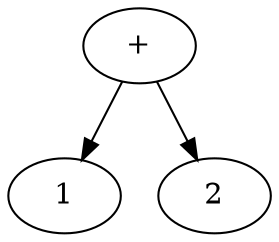

```java
1 + 2 * 3 - 4 / 5
```
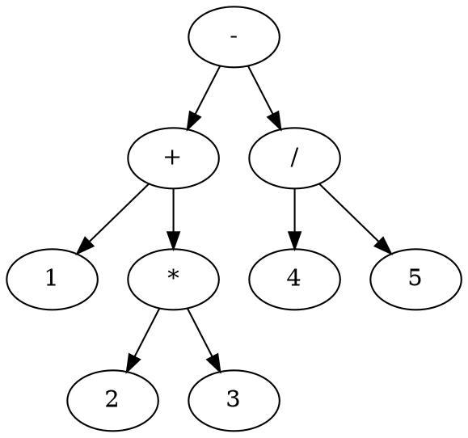

## Algorithm
Categorize elements of arithmetic expression into:
1. Numeric
2. Addition operator
3. Subtraction operator
4. Multiplication operator
5. Division operator

And assign rank for them:

Numeric > Multiplication operator == Division operator > Addition operator == Subtraction operator

Suppose:
* S is an arithmetic expression which consists of **Numeric**, **Addition Operator**, **Subtraction operator**, **Multiplication operator** and **Division operator**
* E is an ordered list, in which each element is one of **Numeric**, **Addition Operator**, **Subtraction operator**, **Multiplication operator** or **Division operator**
* T is a binary tree, in which each node is one of **Numeric**, **Addition Operator**, **Subtraction operator**, **Multiplication operator** or **Division operator**

**Step:**
1. Take first e as the T, point `lastNode` to e
2. For remaining e:
    a. append e as child of `lastNode`
    b. raise e until encounter parent is less than e
    c. point `lastNode` to e

**Raise Algorithm**
Given node e, 
* D is e's left child
* B is e's parent
* B has left child C
* e is B's right child
* A is B's parent

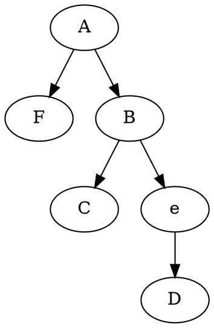
After raised, 
* D should be B's right child
* e should be B's parent
* e take B's position of A, if B is left child of A then e be left child of A, if B is right child of A then e be right child of A
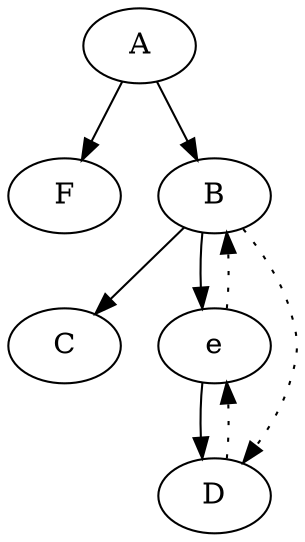
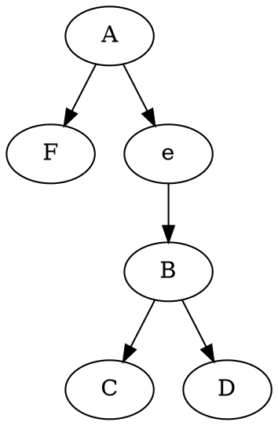

For example, input S `1 + 2 * 3 - 4 / 5`. Tokenize it as 
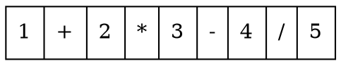
**Case 1:** T is empty, insert e as root of T.
double circle notates `lastNode`
grey circle notates e

**Case 2:** raise e to root of T.
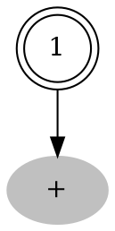
e(+)'s parent (1) is not less than e, then raise e
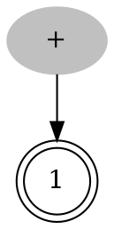
Point `lastNode` to e
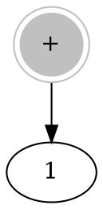
**Case 3:** raise e until encounter parent is less than e.
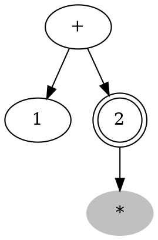
Raise e(`*`) until encounter parent is less than e(`*`)
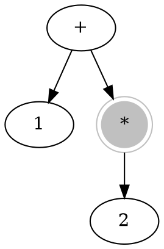
**Case 4:** encounter parent which is less than e, without any raise operation.
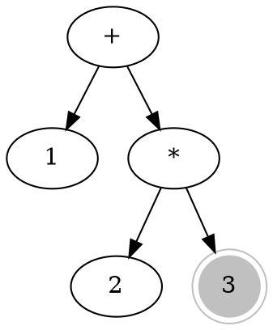
**Case 5:** raise more than once.
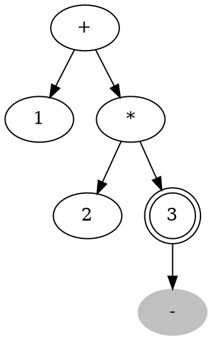
`3` is not less than e(`-`), raise e
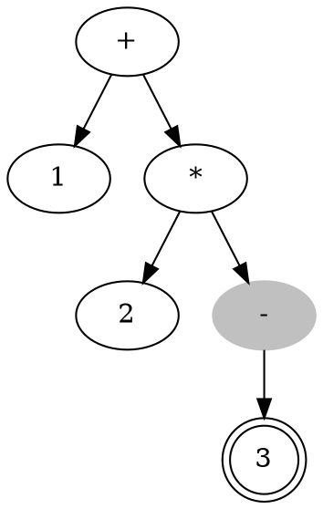
`*` is not less than e(`-`), raise e again
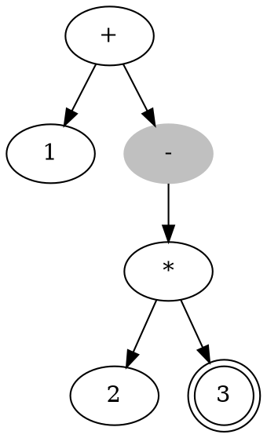
`+` is not less than e(`-`), raise e again
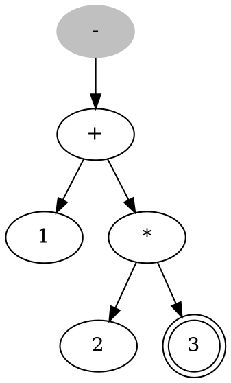
Point `lastNode` to e(`-`)
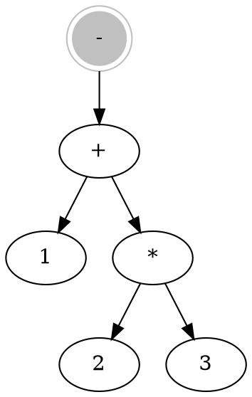

## Reference
1. [Order of Operations](https://en.wikipedia.org/wiki/Order_of_operations) 