## Abstract
Parse literal arithmetic expression into list of tokens, by Deterministic Finite Automaton (DFA).

## Problem
Given literal arithmetic expression, likes
```
1 + 2 * 3.4 - 5.6 / 7
```
Parse it into a list of tokens, likes
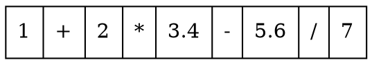

## DFA[1]
**Formal Definition:**
A deterministic finite automaton M is a 5-tuple, ($Q, \Sigma, \delta, q_0, F$), consisting of

* a finite set of states (Q)
* a finite set of input symbols called the alphabet ($\Sigma$)
* a transition function ($δ : Q \times \Sigma \to Q$)
* an initial or start state ($q_0 \in Q$)
* a set of accept states ($F \subseteq Q$)

Let w = $a_1a_2$ ... an be a string over the alphabet $\Sigma$. The automaton M accepts the string w if a sequence of states, $r_0,r_1, ..., r_n$, exists in Q with the following conditions:

1. $r_0 = q_0$
2. $r_i+1 = δ(r_i, a_{i+1})$, for $i = 0, ..., {n-1}$
3. $r_n \in F$

**Example:**
$M = (Q, \Sigma, \delta, q_0, F)$ where

* $Q = \{S_1, S_2\}$,
* $\Sigma = \{0, 1\}$,
* $q_0 = S_1$,
* $F = \{S_1\}$, and
* $\delta$ is defined by the following state transition table:

    |     |0    |1
    |-----|-----|-----
    |$S_1$|$S_2$|$S_1$
    |$S_2$|$S_1$|$S_2$

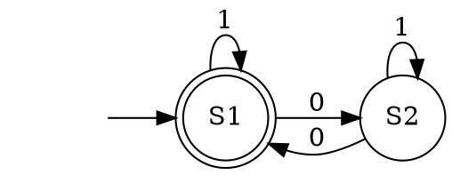

## Tokenize Arithmetic Expression

Define a DFA $M = (Q,\Sigma,\delta,q_0,F)$ where

* $Q = \{S_{space},S_{numberic},S_{operator}\}$
* $\Sigma = \{0,1,2,3,4,5,6,7,8,9,.,+,-,*,/,space\}$
* $q_0 = S_{space}$
* $F = \{S_{space}\}$
* $\delta$ is define by the following state transition table, besides transit state, it perform according action:

    |              |{space}              |{0,1,2,3,4,5,6,7,8,9,.}|{+,-,*,/}
    |--------------|---------------------|-----------------------|----------------------
    |$S_{space}$   |$(A_{nop},S_{space})$|$(A_{buf},S_{numeric})$|$(A_{buf},S_{operator})$
    |$S_{numeric}$ |$(A_{out},S_{space})$|$(A_{buf},S_{numeric})$|$(A_{out},S_{operator})$
    |$S_{operator}$|$(A_{out},S_{space})$|$(A_{out},S_{numeric})$|$(A_{out},S_{operator})$

    * $A_{nop}$ do nothing
    * $A_{buf}$ put input to the buffer
    * $A_{out}$ output content of buffer as a token, and clean the buffer

**Example:**
Given input w:
```
1 + 2.3
```

1. DFA M initialize at state $S_{space}$, and buffer is empty

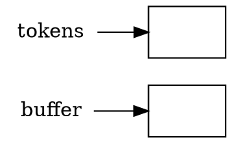
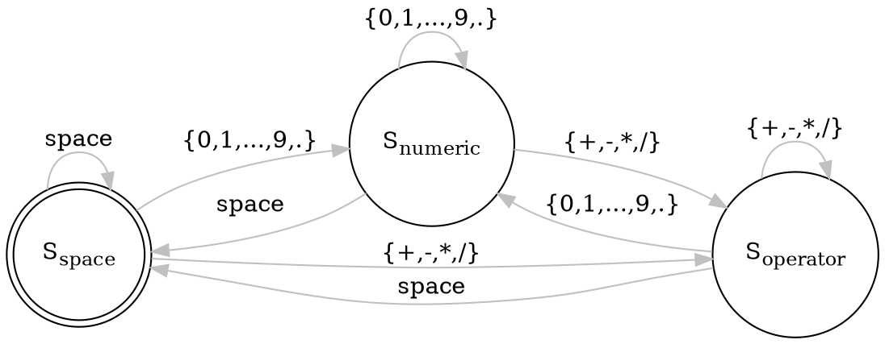

2. input `1`, take action $A_{buf}$, put `1` on the buffer and transit to $S_{numeric}$

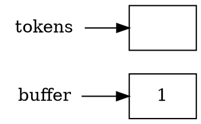
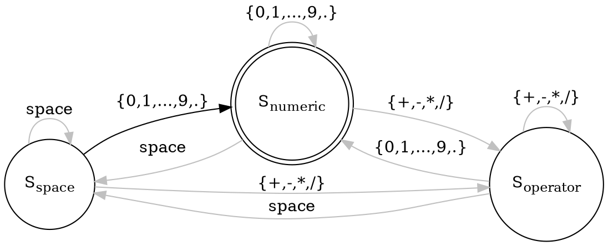

3. input space, take action $A_{out}$ and transit to $S_{space}$

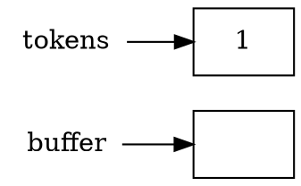
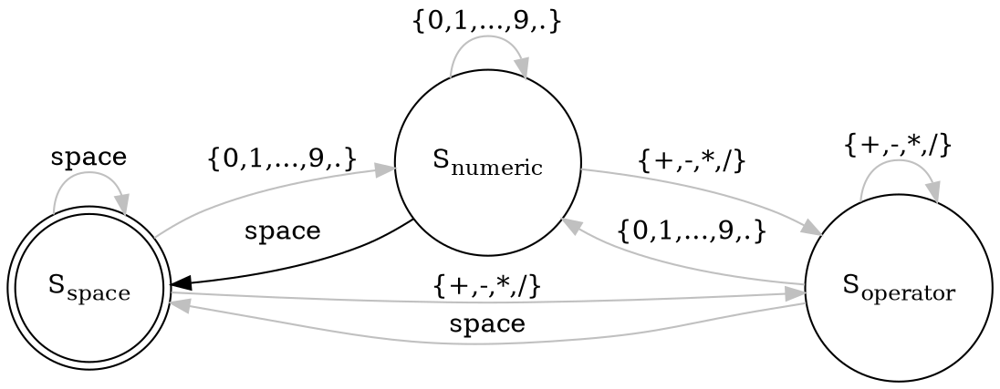

4. input `+`, take action $A_{buf}$ and transit to $S_{operator}$

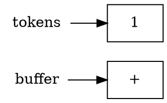
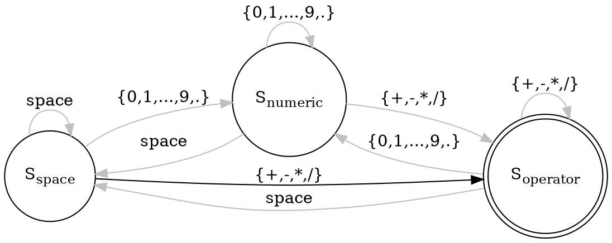

5. input space, take action $A_{out}$ and transit to $S_{space}$

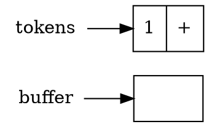
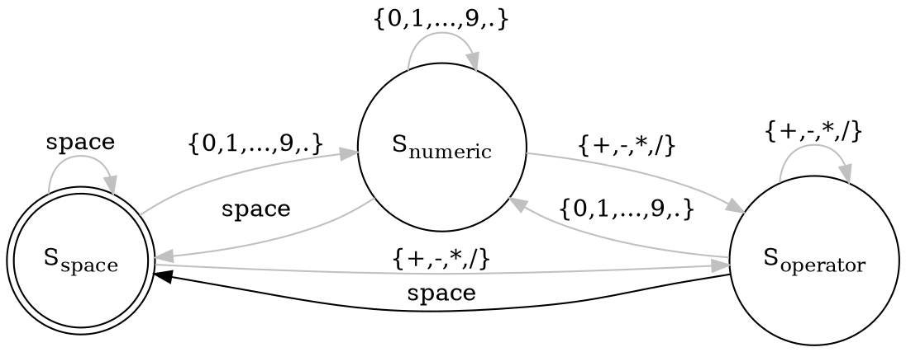

6. input `2`, take action $A_{buf}$ transit to $S_{numeric}$

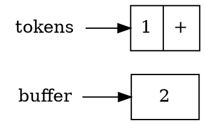


7. input `.`, take action $A_{buf}$ and stay at $S_{numeric}$

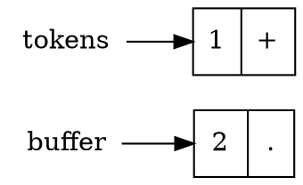
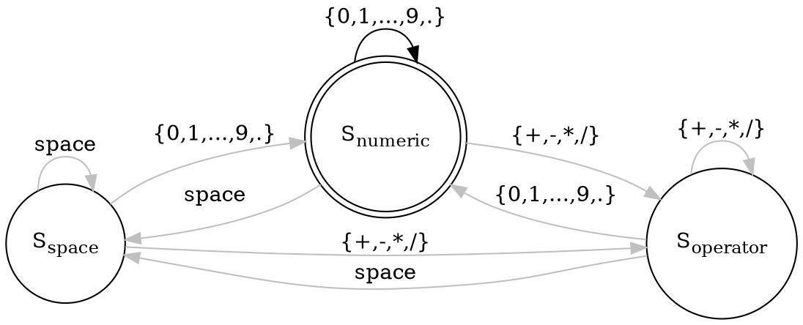

8. input `3`, take action $A_{buf}$ and stay at $S_{numeric}$

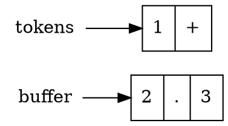


9. encounter end of line, treat as space, take action $A_{out}$ and transit to $S_{space}$

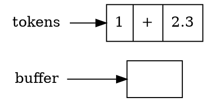


Finally, M stay at $S_{space}$ which $\in F$. And we got token list

```dot
graph g {
    tokens [shape=record,label="1|+|2.3"]
}
```

## Reference

1. [Deterministic Finite Automaton](https://en.wikipedia.org/wiki/Deterministic_finite_automaton)
