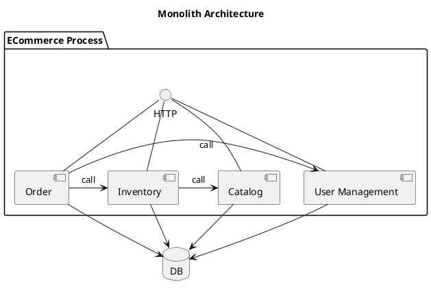
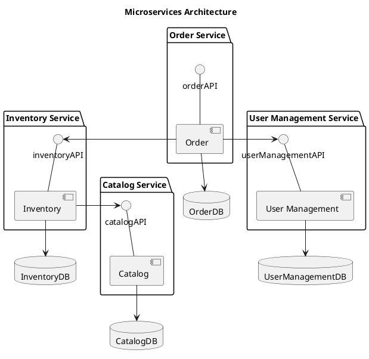
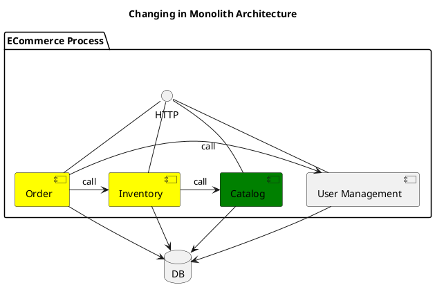
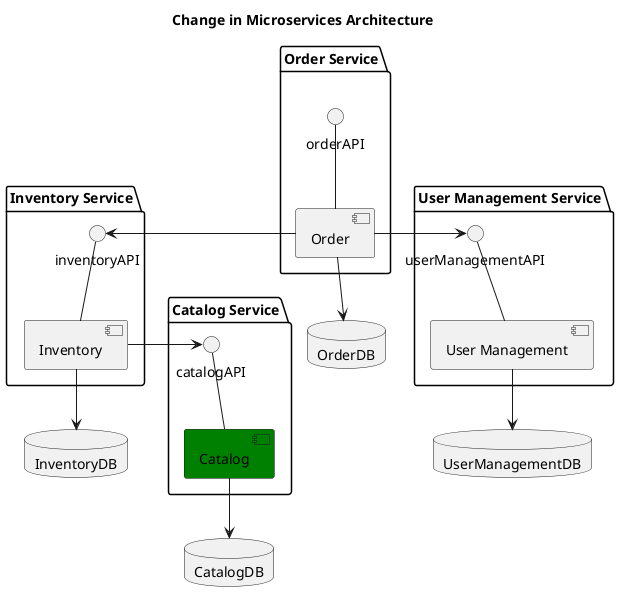
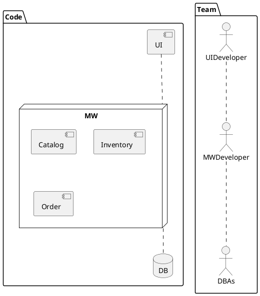
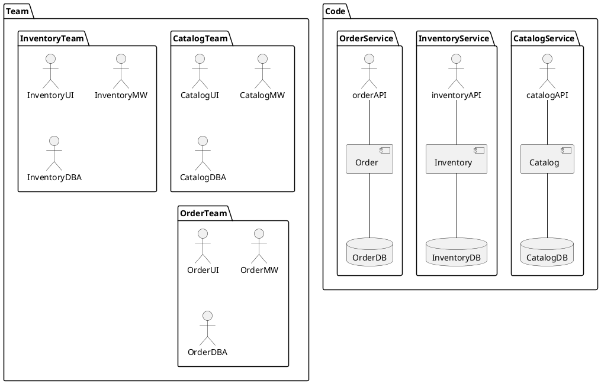
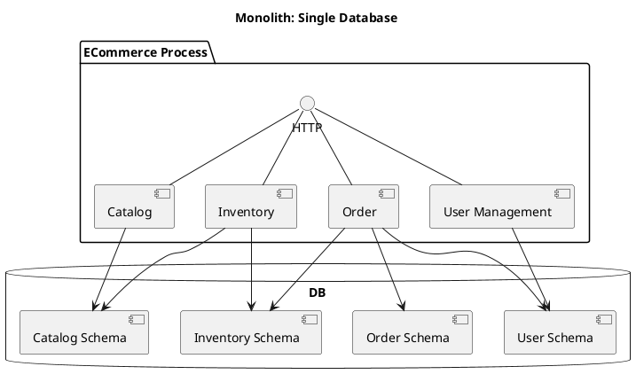
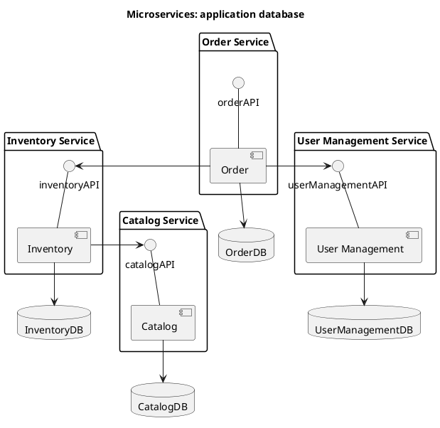

## Overview

The term "Microservice Architecture" has sprung up over the last few years to describe a particular way of designing software applications as suites of independently deployable services. While there is no precise definition of this architectural style, there are certain common characteristics around organization around business capability, automated deployment, intelligence in the endpoints, and decentralized control of languages and data.

## Monolith vs Microservices

## Monolith Architecture

A classic monolith application maybe split functionalities into components, but components will be assembled into one package and executed as single process at the end. Because components are assembled into one process, therefore it intends to communicate via internal-process approach, likes directly method invocation.

### Microservices Architecture

In microservices architecture, entire application consists of multiple processes. Each process only respond to single functionality, and processes are communicating through well-defined interface, likes HTTP, RESTFul, message mechanism, etc. Each one process could be called a service.

Generally services do not share data store. Instead, each service own separate data store.

## Benefit

### Componentization via Services

Microservices application split functionality into multiple single and small services, each service is running in separate process, and services are communicating to each other through well-defined, cross-networking interface. So that it is capable to change and deploy functionality/service independently.

For example, it want to change component `Catalog`. Because component `Inventory` is calling `Catalog` through `method invocation` which provided by programming language, therefore it maybe change `Inventory` too, at least recompile. And `Order` is depending on `Inventory`, thus has to recompile `Order` too.

Let us see what will happen if change `Catalog` in microservices application.
In microservices, `Inventory` is not depending on `Catalog` directly. Instead, `Inventory` is depending on `catalogAPI`. `catalogAPI` is a well-defined interface, it could be HTTP/RESTFul or message queue. If this change does not modify `catalogAPI`, it would not break anything. Therefore `Catalog` could be changed independently.
And all services are deployed in separate process, therefor it only need build and deploy `Catalog Service`.

### Organized around Business Capabilities

> Any organization that designs a system (defined broadly) will produce a design whose structure is a copy of the organization's communication structure.
> 
> -- Melvyn Conway, 1967

> Siloed functional teams ...
> lead to siloed application architecture.
> Because of Conway's Law

When adopted monolith architecture, teams are usually split based on functions, code are organized by layers. Each business change request need changes on all layers. It means that, each change has to involve entire team (global team).

When adopted microservices architecture, because application is split into many small service, and each service is built and ran on independent technology stack. Therefore team should be split into small cross-functional team, based on business/functionality. One service is only maintained by one small team in principle. One small team may and usually respond to multiple services.
Per services are split based on business/functionality, the boundaries of services are well-defined, and each small team is cross-functional, thus it is able to reduce overhead cross-team/region communication as well as possible.

### Decentralized Data Management

In monolith architecture, all data is stored in a single, centre database. All components access to the single database.

**Pros:**

1. Strong consistency

**Cons:**

1. Hard to scale out
2. Hard to update schema 

In microservices, each service has separate database, and there is not directly connection between databases.

**Pros:**

1. Easy to scale out
2. Support hybrid databases
3. Easy to update schema

**Cons:**

1. No strong consistency
2. Application respond for transaction

## How to Survive

### 12 Factor Application

>The twelve-factor app is a methodology for building software-as-a-service apps that:
>
> * Use declarative formats for setup automation, to minimize time and cost for new developers joining the project;
> * Have a clean contract with the underlying operating system, offering maximum portability between execution environments;
> * Are suitable for deployment on modern cloud platforms, obviating the need for servers and systems administration;
> * Minimize divergence between development and production, enabling continuous deployment for maximum agility;
> * And can scale up without significant changes to tooling, architecture, or development practices.

1. **Codebase** One codebase tracked in revision control, many deploys
2. **Dependencies** Explicitly declare and isolate dependencies
3. **Config** Store config in the environment
4. **Backing services** Treat backing services as attached resources
5. **Build, release, run** Strictly separate build and run stages
6. **Processes** Execute the app as one or more stateless processes
7. **Port binding** Export services via port binding
8. **Concurrency** Scale out via the process model
9. **Disposability** Maximize robustness with fast startup and graceful shutdown
10. **Dev/prod parity** Keep development, staging, and production as similar as possible
11. **Logs** Treat logs as event streams
12. **Admin processes** Run admin/management tasks as one-off processes

## Reference

1. [Microservices](https://martinfowler.com/articles/microservices.html)
2. [The twelve-factor app](https://12factor.net/)

