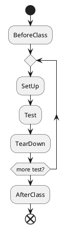

# Mock Oracle Database by Docker

> for testing

* TOC
{:toc}

## Overview

Many application is accessing database through handwrite SQL, even SQL dialect. For testing these code, it has to mock a real compatible database instance. Here I describe a soluition of mocking Oracle database by Docker.

## Use Case

Method `findById` of data access object `CategoryDao` query database by [Hierarchical Queries](https://docs.oracle.com/cd/B19306_01/server.102/b14200/queries003.htm). It need a unit test case to cover the implementation of `CategoryDao.findById`.

```sql
SELECT * FROM DEV.CATEGORY START WITH ID = :id CONNECT BY PRIOR ID=PARENT_ID
```

Because the Hierarchical Queries is not supported by in-memory databases (includes HSQLDB, H2). Therefore it has to mock database by real Oracle database instance. And for a well-designed unit test case, it should:

* Repeatable, it is able to be executed on any environment and any time.
* Do not depend on external resource, it should embbed all necessary resources.

## Solution

Take JUnit as test framework, create and destroy Oracle database instance on phases `BeforeClass` and `AfterClass` respectively. Here take advantage of Docker, to create and destory Oracle database instance fastly.
On phase `BeforeClass`, it call Docker engine through Remote API, to create Oracle database instance. On phase `AfterClass`, it call Docker engine, to destroy the Oracle database instance.

### System and Software Information

Name|Version
----|-------
OS  | Ubuntu 16.04.4 LTS (GNU/Linux 4.4.0-116-generic x86_64)
Docker| 17.12.1-ce, build 7390fc6

### Docker

> Docker provides a way to run applications securely isolated in a container, packaged with all its dependencies and libraries.

#### Install Docker

See offical document [Install Docker](https://docs.docker.com/install/linux/docker-ce/ubuntu/#install-docker-ce-1).

#### Enable Remote API

Set the hosts array in the `/etc/docker/daemon.json` to connect to the UNIX socket and an IP address, as follows:

```json
{
  "hosts": ["fd://", "tcp://0.0.0.0:4243"]
}
```

Restart docker daemon

```shell
service docker restart
```

It may get error:

```txt
unable to configure the Docker daemon with file /etc/docker/daemon.json: the following directives are specified both as a flag and in the configuration file: hosts: (from flag: [fd://], from file: [tcp://0.0.0.0:4243])
```

It because `docker.service` hard code argument `-H fd://` for `/usr/bin/dockerd`. Edit `/lib/systemd/system/docker.service`, change `ExecStart=/usr/bin/dockerd -H fd://` to `ExecStart=/usr/bin/dockerd`.

```txt
[Service]
Type=notify
# the default is not to use systemd for cgroups because the delegate issues still
# exists and systemd currently does not support the cgroup feature set required
# for containers run by docker
ExecStart=/usr/bin/dockerd
ExecReload=/bin/kill -s HUP $MAINPID
LimitNOFILE=1048576
```

Reload `docker.service`

```shell
systemctl daemon-reload
```

Then restart docker daemon

```shell
service docker restart
```

#### Verify Docker Remote API

List installed images by commandline client `docker`, it commuicates with docker daemon via sock `unix:///var/run/docker.sock`

```shell
dev@ubuntu-vb:~$ docker image ls
REPOSITORY          TAG                 IMAGE ID            CREATED             SIZE
sath89/oracle-12c   latest              17cd1ab9d9a7        3 months ago        5.7GB
hello-world         latest              f2a91732366c        3 months ago        1.85kB
```

Send `GET` HTTP request to `http://ubuntu-vb:4243/images/json`, it should get same image list as via commandline client `docker`.

```http
GET /images/json HTTP/1.1
Host: ubuntu-vb:4243
Connection: keep-alive
Cache-Control: max-age=0
Upgrade-Insecure-Requests: 1
User-Agent: Mozilla/5.0 (Macintosh; Intel Mac OS X 10_13_3) AppleWebKit/537.36 (KHTML, like Gecko) Chrome/62.0.3202.94 Safari/537.36
Accept: text/html,application/xhtml+xml,application/xml;q=0.9,image/webp,image/apng,*/*;q=0.8
Accept-Encoding: gzip, deflate
Accept-Language: zh-CN,zh;q=0.9,en;q=0.8
```

```http
HTTP/1.1 200 OK
Api-Version: 1.35
Content-Type: application/json
Docker-Experimental: false
Ostype: linux
Server: Docker/17.12.1-ce (linux)
Date: Sat, 17 Mar 2018 13:34:59 GMT
Content-Length: 682

[{
    "Containers": -1,
    "Created": 1512650278,
    "Id": "sha256:17cd1ab9d9a7faf883ec2a0b3be19c221fe38212961c925f289e88823ed24a9c",
    "Labels": {},
    "ParentId": "",
    "RepoDigests": ["sath89/oracle-12c@sha256:a0f6f1cfd3738b0c00f4025a656335b53c205b3bfc0722908ee7b1469111665b"],
    "RepoTags": ["sath89/oracle-12c:latest"],
    "SharedSize": -1,
    "Size": 5703441170,
    "VirtualSize": 5703441170
}, {
    "Containers": -1,
    "Created": 1511223798,
    "Id": "sha256:f2a91732366c0332ccd7afd2a5c4ff2b9af81f549370f7a19acd460f87686bc7",
    "Labels": null,
    "ParentId": "",
    "RepoDigests": ["hello-world@sha256:97ce6fa4b6cdc0790cda65fe7290b74cfebd9fa0c9b8c38e979330d547d22ce1"],
    "RepoTags": ["hello-world:latest"],
    "SharedSize": -1,
    "Size": 1848,
    "VirtualSize": 1848
}]
```

### Dockerizing Oracle Database

Oracle does not offer offical docker image of Oracle Database, but provide [docker file](https://github.com/oracle/docker-images/tree/master/OracleDatabase/SingleInstance), allow users to build image by themselves. Besides, there are a lot of thrid party Oracle Database docker images. Here I use third party Oracle Database docker images [sath89/oracle-xe-11g](https://hub.docker.com/r/sath89/oracle-xe-11g/) for convience.

```shell
docker pull sath89/oracle-xe-11g
```

```shell
docker run -d -e WEB_CONSOLE=false -p 1521:1521 sath89/oracle-xe-11g
```

```txt
port: 1521
sid: xe
service name: xe
username: system
password: oracle
```

```http
POST /containers/create HTTP/1.1
content-type: application/json

{
    "Env":[
        "WEB_CONSOLE=false"    ],
    "Image":"sath89/oracle-xe-11g",
    "HostConfig":{
        "PortBindings":{
            "1521/tcp":[
                {
                    "HostPort":"1521"
                }
            ]
        }
    }
}
```

```http
HTTP/1.1 201 Created
api-version: 1.35
content-type: application/json
docker-experimental: false
ostype: linux
server: Docker/17.12.1-ce (linux)
date: Mon, 19 Mar 2018 13:57:28 GMT
content-length: 90

{
"Id": "0eb6f3bfcdeba9fd604bae3f684d077a59b8a5c8daad0fa947977a284e80ac93",
"Warnings": null
}
```

```http
POST /containers/{containerId}/start HTTP/1.1
```

```http
HTTP/1.1 204 No Content
api-version: 1.35
docker-experimental: false
ostype: linux
server: Docker/17.12.1-ce (linux)
date: Mon, 19 Mar 2018 14:04:59 GMT

```

```http
POST /containers/{containerId}/stop HTTP/1.1
```

```http
HTTP/1.1 204 No Content
api-version: 1.35
docker-experimental: false
ostype: linux
server: Docker/17.12.1-ce (linux)
date: Mon, 19 Mar 2018 14:02:34 GMT

```

```http
DELETE /containers/{containerId} HTTP/1.1
```

```http
HTTP/1.1 204 No Content
api-version: 1.35
docker-experimental: false
ostype: linux
server: Docker/17.12.1-ce (linux)
date: Mon, 19 Mar 2018 14:07:41 GMT

```

Force delete container

```http
DELETE /containers/{containerId}?force=true HTTP/1.1
```

```http
HTTP/1.1 204 No Content
api-version: 1.35
docker-experimental: false
ostype: linux
server: Docker/17.12.1-ce (linux)
date: Mon, 19 Mar 2018 14:09:53 GMT
```

### Test Case

JUnit defines below five phases for test case:

* BeforeClass
* SetUp
* Test
* TearDown
* AfterClass

Each **test case** is able to contain one or more **test**. It firstly executes **BeforeClass**, then executes **test** one by one, finally executes **AfterClass**. For each **test**, it executes **SetUp** and **TearDown** before and after.



For keeping **test case** independent and reducing unneccessary overhead, it should create separate Oracle database instance for each **test case**, and all **test** share one instance. Thus it create Oracle database instance on phase **BeforeClass** and destroy it on phase **AfterClass**.
[docker-client](https://github.com/spotify/docker-client) is

> a simple docker client for JVM

which contributed by [Spotify](https://spotify.github.io/). With [docker-client](https://github.com/spotify/docker-client), it is easy to access Docker API.

#### Create Oracle Database Instance when BeforeClass

Steps to create an Oracle database instance in Docker:

1. create container, specify **image**, **port binding** and **evironment valirables**
2. start container
3. waiting for database up, Oracle database instance is not ready even **start container** request completed. Therefore it need to wait until Oracle database instance is really up
4. pass database instance connection information, includes JDBC URL, username, password and driver class

```java
  @BeforeClass
  public static void beforeClass() throws Exception {
    String dockerHost = System.getProperty(DOCKER_HOST, "unix:///var/run/docker.sock");
    String databaseHost = System.getProperty(DOCKER_DATABASE_HOST, "127.0.0.1");
    String image = System.getProperty(DOCKER_IMAGE_ORACLE, "sath89/oracle-xe-11g");
    String urlTemplate = System
        .getProperty(DOCKER_DATABASE_URL_TEMPLATE, "jdbc:oracle:thin:@%s:%d:xe");
    String databaseUsername = System.getProperty(DOCKER_DATABASE_USERNAME, "system");
    String databasePassword = System.getProperty(DOCKER_DATABASE_PASSWORD, "oracle");
    String driverClass = System
        .getProperty(DOCKER_DATABASE_DRIVER_CLASS, "oracle.jdbc.driver.OracleDriver");

    DefaultDockerClient docker = DefaultDockerClient.builder().uri(new URI(dockerHost)).build();
    Map<String, List<PortBinding>> portBindings = new TreeMap<>();
    portBindings.put("1521/tcp", Arrays.asList(PortBinding.randomPort("0.0.0.0")));
    ContainerConfig config = ContainerConfig.builder().image(image)
        .hostConfig(HostConfig.builder().portBindings(portBindings).build())
        .env("WEB_CONSOLE=false")
        .build();
    ContainerCreation creation = docker.createContainer(config);
    docker.startContainer(creation.id());
    ContainerInfo info = docker.inspectContainer(creation.id());
    final int port = Integer
        .valueOf(info.networkSettings().ports().get("1521/tcp").get(0).hostPort());

    System.setProperty(DOCKER_DATABASE_CONTAINER_ID, creation.id());

    //Thread.sleep(60000);
    final long MAX_WAIT_SECOND = 90;
    long startCheckAt = System.currentTimeMillis() / 1000;
    while (!checkIfUp(driverClass, String.format(urlTemplate, databaseHost, port), databaseUsername,
        databasePassword)) {
      long now = System.currentTimeMillis() / 1000;
      LOGGER.info(
          String.format("Checking if database is up for %d second", now - startCheckAt));
      if (now - startCheckAt > MAX_WAIT_SECOND) {
        throw new Exception(String
            .format("Start database fail, not ready after %d seconds", now - startCheckAt));
      }
      Thread.sleep(5000);
    }

    System.setProperty(PropertiesBasedJdbcDatabaseTester.DBUNIT_CONNECTION_URL,
        String.format(urlTemplate, databaseHost, port));
    System.setProperty(PropertiesBasedJdbcDatabaseTester.DBUNIT_USERNAME, databaseUsername);
    System.setProperty(PropertiesBasedJdbcDatabaseTester.DBUNIT_PASSWORD, databasePassword);
    System.setProperty(PropertiesBasedJdbcDatabaseTester.DBUNIT_DRIVER_CLASS, driverClass);
  }
```

#### Destory Oracle Database Instance when AfterClass

An elegent way to destroy a container is that stop container firstly then remove it. But stopping a Oracle database instance is a time-consuming operation. Therefore I take a rude but efficient way, kill then remove.

```java
  @AfterClass
  public static void afterClass() throws Exception {
    String dockerHost = System.getProperty("docker.host", "unix:///var/run/docker.sock");
    String containerId = System.getProperty("docker.database.containerId");

    DefaultDockerClient docker = DefaultDockerClient.builder().uri(new URI(dockerHost)).build();
    docker.killContainer(containerId);
    docker.removeContainer(containerId);
  }
```

### Continuous Integration

#### Travis CI

`.travis.yml`

```yaml
language: java
sudo: required
services:
  - docker
install: true
addons:
  sonarcloud:
    organization: $SONAR_CLOUD_ORGANIZATION
    token: $SONAR_CLOUD_TOKEN
jdk:
  - oraclejdk8
before_install:
  - docker pull sath89/oracle-xe-11g
cache:
  directories:
    - '$HOME/.m2/repository'
    - '$HOME/.sonar/cache'
jobs:
  include:
    - stage: compile
      script: mvn clean compile
    - stage: verify
      script: mvn org.jacoco:jacoco-maven-plugin:prepare-agent test sonar:sonar
stages:
  - compile
  - verify
```

Build log:
[https://travis-ci.org/rscai/docker-mock-db/builds/359397887](https://travis-ci.org/rscai/docker-mock-db/builds/359397887)

#### Code Example

[https://github.com/rscai/docker-mock-db](https://github.com/rscai/docker-mock-db)

## Reference

* [Install Docker](https://docs.docker.com/install/linux/docker-ce/ubuntu/#install-docker-ce-1)
* [Docker Engine API](https://docs.docker.com/engine/api/latest/)
* [Examples using the Docker Engine SDKs and Docker API](
* [Quick Tip – How to enable Docker Remote API?](https://www.virtuallyghetto.com/2014/07/quick-tip-how-to-enable-docker-remote-api.html)