# Java Collections: ArrayList vs LinkedList

[TOC]

## Overview

`ArrayList` and `LinkedList` are common implementations of `java.util.List`. This article compares the data structure and complexity of them.

## Java Collections

> A collection — sometimes called a container — is simply an object that groups multiple elements into a single unit. Collections are used to store, retrieve, manipulate, and communicate aggregate data. Typically, they represent data items that form a natural group, such as a poker hand (a collection of cards), a mail folder (a collection of letters), or a telephone directory (a mapping of names to phone numbers).
>
> A collections framework is a unified architecture for representing and manipulating collections. All collections frameworks contain the following:
> * Interfaces: These are abstract data types that represent collections. Interfaces allow collections to be manipulated independently of the details of their representation. In object-oriented languages, interfaces generally form a hierarchy.
> * Implementations: These are the concrete implementations of the collection interfaces. In essence, they are reusable data structures.
> * Algorithms: These are the methods that perform useful computations, such as searching and sorting, on objects that implement collection interfaces. The algorithms are said to be polymorphic: that is, the same method can be used on many different implementations of the appropriate collection interface. In essence, algorithms are reusable functionality.

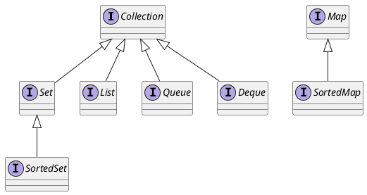

### List

> A List is an ordered Collection (sometimes called a sequence). Lists may contain duplicate elements. In addition to the operations inherited from Collection, the List interface includes operations for the following:
>
> * Positional access — manipulates elements based on their numerical position in the list. This includes methods such as get, set, add, addAll, and remove.
> * Search — searches for a specified object in the list and returns its numerical position. Search methods include indexOf and lastIndexOf.
> * Iteration — extends Iterator semantics to take advantage of the list's sequential nature. The listIterator methods provide this behavior.
> * Range-view — The sublist method performs arbitrary range operations on the list.
>
> The Java platform contains two general-purpose List implementations. ArrayList, which is usually the better-performing implementation, and LinkedList which offers better performance under certain circumstances.

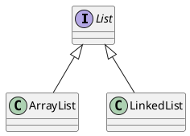

## ArrayList

`ArrayList` is a resizable-array implementation of the `List` interface. It stores elements (references) in native array.

### Data Structure

`ArrayList` maintains a native array, to store elements. As well known, native array is fixed length, but `List` is variable length. Therefore it cannot resue native array's length as list's length. `ArrayList` maintains a `size` which indicates the actual count of elements.

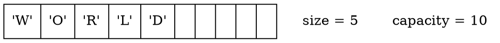

### Time Complexity

Implementation|add(E)|add(i,E)|get(i)|remove(i)|set(i,E)|indexOf(Object)
--------------|------|----------|--------|-----------|----------|---------------
ArrayList     |$\mathcal{O}(1)$|$\mathcal{O}(n)$|$\mathcal{O}(1)$|$\mathcal{O}(n)$|$\mathcal{O}(1)$|$\mathcal{O}(n)$

#### add(E)

`add(E)` appends `E` to tail of list, therefore it need not shift anything. Explain algorithm of `add(E)` in java:

```java
array[size] = E;
size = size + 1;
```

$$
\begin{align*}
C &= 1+1 \\
  &= 2 \\
  &= \mathcal{O}(1)
\end{align*}
$$

#### add(i, E)

To add `E` to `i`, it should shift i-th to size-th elements right by one step. 
Take `add(2,E)` as an example, it should shift all right elements by one step.

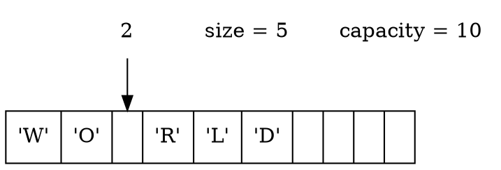

Then insert `E` at position `2`.


Algorithm in Java:

```java
for(int index =size - 1; index >= i; index--){
    array[index+1] = array[index];
}
array[i] = E;
```

Time Complexity:

$$
\begin{align*}
C &= n-1-i+1 \\
  &= n-i \\
C_{avg} &= \frac{1}{n}\sum\limits_{i=0}^{n-1} (n-i) \\
        &= \frac{1}{n}(n^2-\frac{n^2}{2}+\frac{n}{2}) \\
        &= n-\frac{n}{2}+\frac{1}{2} \\
        &= \frac{n}{2}+\frac{1}{2} \\
        &= \mathcal{O}(n)
\end{align*}
$$

#### get(i)

Getting element by index is a primative operation of native array.
Take `get(2)` as an example, it is able get access native array by index directly.

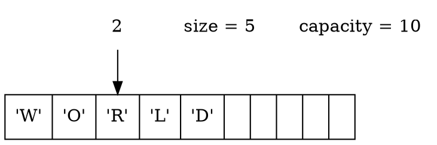

Algorithm in Java:

```java
array[i];
```

Time Complexity:

$$
\begin{align*}
C &= \mathcal{O}(1)
\end{align*}
$$

#### remove(i)

It should shift (i+1)-th to (size-1)-th left by one step.
Take `remove(3)` as an example, it shift elements left by one step.

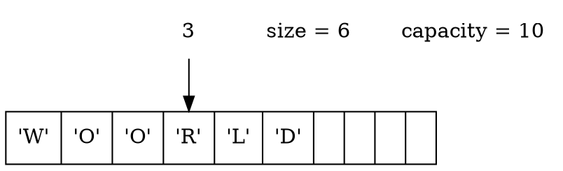

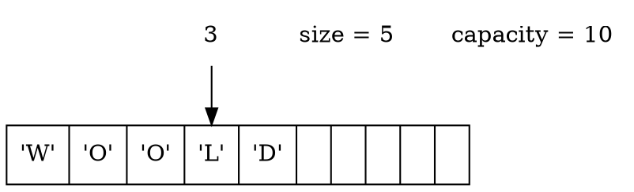

Algorithm in Java:

```java
for(int index = i; i< size - 1; index++){
    array[index] = array[index+1];
}
size = size - 1;
```

Time Complexity:

$$
\begin{align*}
C &= n-1-i+1 \\
  &= n-i \\
C_{avg} &= \frac{1}{n}\sum\limits_{i=0}^{n-1} (n-i) \\
        &= \frac{1}{n}(n^2-\frac{n^2}{2}+\frac{n}{2}) \\
        &= (n-\frac{n}{2}+\frac{1}{2} \\
        &= \frac{n}{2}+\frac{1}{2} \\
        &= \mathcal{O}(n)
\end{align*}
$$

#### set(i,E)

It is able to access native array by position directly.
Take `set(2,E)` as example, it just write `E` on position `2`.

Algorithm in Java:

```java
array[i] = E;
```

Time Complexity:

$$
\begin{align*}
C &= \mathcal{O}(1)
\end{align*}
$$

#### indexOf(Object)

It should go though array until encounter `Object`.

Algorithm in Java:

```java
for(int i=0;i<array.length;i++){
    if(array[i]==object){
        return i;
    }
}
return -1;
```

Time Complexity:

$$
\begin{align*}
C &= i \\
C_{avg} &= \frac{1}{n}\sum\limits_{i=1}^{n} i \\
        &= \frac{1}{n}(\frac{n}{2}(n+1)) \\
        &= \mathcal{O}(n)
\end{align*}
$$

### Benchmark

Benchmark                           |      (n) | Mode | Cnt|      Score |     Error | Units
------------------------------------|----------|------|----|------------|-----------|------
ArrayListBenchmark.measureAdd       |         10000|  thrpt|   20|  77234614.958| ± 27364608.439|  ops/s
ArrayListBenchmark.measureAdd       |        100000|  thrpt|   20|  58740386.300| ± 14956922.100|  ops/s
ArrayListBenchmark.measureAdd       |       1000000|  thrpt|   20|  42085361.259| ± 10362464.548|  ops/s
ArrayListBenchmark.measureAdd       |      10000000|  thrpt|   20|  14568270.821| ±  2031383.157|  ops/s
ArrayListBenchmark.measureAddAtIndex|         10000|  thrpt|   20|    133096.896| ±      378.850|  ops/s
ArrayListBenchmark.measureAddAtIndex|        100000|  thrpt|   20|     93916.433| ±      569.356|  ops/s
ArrayListBenchmark.measureAddAtIndex|       1000000|  thrpt|   20|     15222.869| ±      787.399|  ops/s
ArrayListBenchmark.measureAddAtIndex|      10000000|  thrpt|   20|       543.267| ±       46.943|  ops/s
ArrayListBenchmark.measureGet       |         10000|  thrpt|   20|  13486663.625| ±    52288.061|  ops/s
ArrayListBenchmark.measureGet       |        100000|  thrpt|   20|   9854966.665| ±   164391.241|  ops/s
ArrayListBenchmark.measureGet       |       1000000|  thrpt|   20|   3202685.257| ±    40712.289|  ops/s
ArrayListBenchmark.measureGet       |      10000000|  thrpt|   20|   2076313.423| ±   847405.155|  ops/s
ArrayListBenchmark.measureIndexOf   |         10000|  thrpt|   20|    132575.039| ±     6098.777|  ops/s
ArrayListBenchmark.measureIndexOf   |        100000|  thrpt|   20|     12231.681| ±      295.380|  ops/s
ArrayListBenchmark.measureIndexOf   |       1000000|  thrpt|   20|       814.599| ±       41.022|  ops/s
ArrayListBenchmark.measureIndexOf   |      10000000|  thrpt|   20|        69.822| ±        2.525|  ops/s
ArrayListBenchmark.measureRemoveAtIndex|   10000000|  thrpt|    9|       738.977| ±       75.723|  ops/s
ArrayListBenchmark.measureSetAtIndex|         10000|  thrpt|   20|  13493191.944| ±    84782.615|  ops/s
ArrayListBenchmark.measureSetAtIndex|        100000|  thrpt|   20|  13126047.419| ±    64602.511|  ops/s
ArrayListBenchmark.measureSetAtIndex|       1000000|  thrpt|   20|  12518930.786| ±   170425.857|  ops/s
ArrayListBenchmark.measureSetAtIndex|      10000000| thrpt |  20|   5680297.795| ±  1946148.153|  ops/s


## LinkedList

### Data Structure

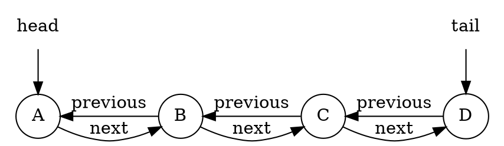

### Time Complexity

Implementation|add(E)|add(i,E)|get(i)|remove(i)|set(i,E)|indexOf(Object)
--------------|------|----------|--------|-----------|----------|---------------
LinkedList     |$\mathcal{O}(1)$|$\mathcal{O}(n)$|$\mathcal{O}(n)$|$\mathcal{O}(n)$|$\mathcal{O}(n)$|$\mathcal{O}(n)$

#### add(E)

1. find last node
2. point last one's next to new node E, and point new node's previous to last node
3. point tail to new node

Given a link which has ntwo nodes A and B, node A is the head, and node B is the tail.

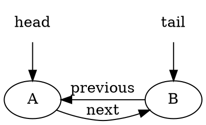

Add new node E, point node B's next to node E, and point previous of node E to node B.

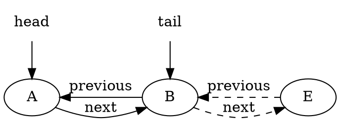

Finally, point `tail` to node E.

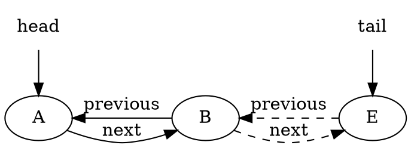

Algorithm in Java:

```java
Node e = new Node();
tail.next = e;
e.previous = tail;
tail = e;
```

Time Complexity:

$$
\begin{align*}
C &= 1+1+1 \\
  &= \mathcal{O}(1)
\end{align*}
$$

#### add(i,E)

1. find the i-th node,
2. insert new node E
  2.1 point (i-1)-th node's next to node E
  2.2 point node E's previous to (i-1)-th node
  2.3 point node E's next to i-th node
  2.4 point i-th node's previous to node E

Given a link which has three nodes A, B and C.

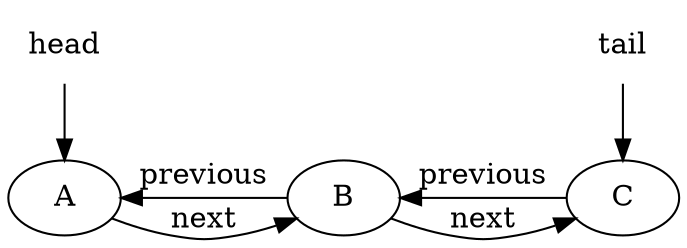

Find the i-th node. Suppose `i` is `1`.

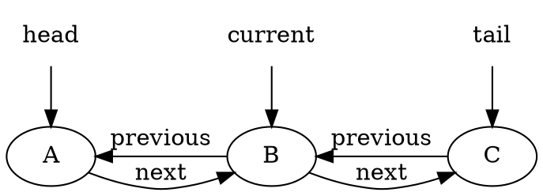

insert node e between A and B.

1. point B's previous (A)'s next to E
2. point E's previous to B's previous (A)
3. point E's next to current (B)
4. point current node (B)'s previous to E

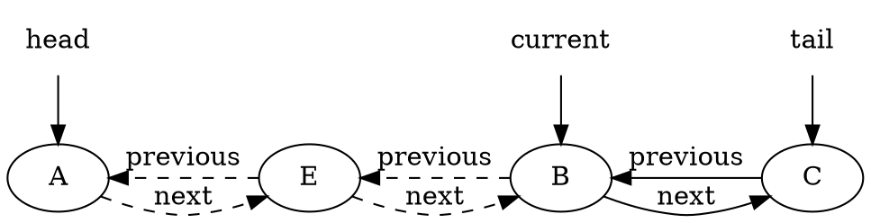

Algorithm in Java:

```java
Node current = get(i);
current.previous.next = e;
e.previous = current.previous;
current.previous = e;
e.next = current;
```

Time Complexity

$$
\begin{align*}
C &= \mathcal{O}(n) + 1 +1 +1 \\
  &= \mathcal{O}(n)
\end{align*}
$$

#### get(i)

Walk one by one until get i-th one.

0-th

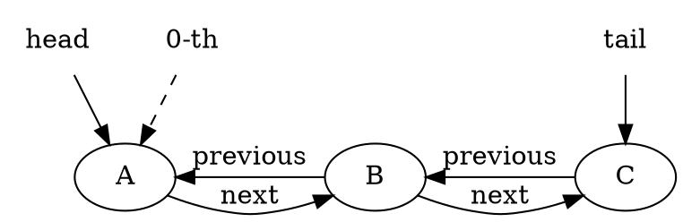

`1-th` one just is next of `0-th`

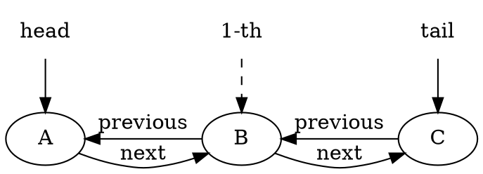

Algorithm in Java

```java
Node current = head;
for(int index =1;index <=i;index++){
    current = current.next;
}
```

Time Complexity

$$
\begin{align*}
C &= i \\
C_{avg} &= \frac{1}{n}\sum\limits_{i=1}^{n}i \\
        &= \frac{1}{n}\frac{n}{2}(n+1) \\
        &= \frac{n}{2}+\frac{1}{2} \\
        &= \mathcal{O}(n)
\end{align*}
$$

#### remove(i)

1. find i-th node
2. remove it
  2.1 point i-th's previous' next to i-th's next
  2.2 point i-th's next's previous to i-th's previous

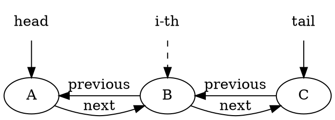

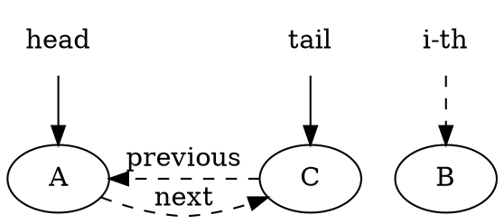

Algorithm in Java

```java
Node current = get(i);
current.previous.next = current.next;
current.next.previous = current.previous;
```

Time Complexity

$$
\begin{align*}
C &= \mathcal{O}(n)+ 1 + 1 \\
  &= \mathcal{O}(n)
\end{align*}
$$

#### set(i,E)

1. find i-th node
2. set element of i-th as E

Algorithm in Java

```java
Node current = get(i);
current.element = E;
```

Time Complexity

$$
\begin{align*}
C &= \mathcal{O}(n) + 1 \\
  &= \mathcal{O}(n)
\end{align*}
$$

#### indexOf(Object)

1. go through link until find object

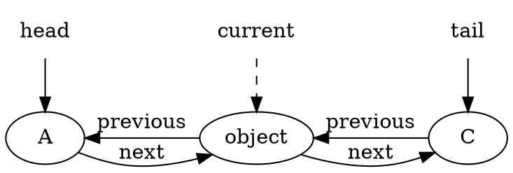

Algorithm in Java

```java
Node current= head;
if(current==null){
    return -1;
}
if(current.element.equals(object)){
    return 0;
}
int index=0;
while(current!=null&&!current.element.equals(object)){
    current = current.next;
    index++;
}

if(current!=null){
    return index;
}else{
    return -1;
}
```

Time Complexity

$$
\begin{align*}
C &= 1 +1 +i +1 \\
C_{avg} &= \frac{1}{n}\sum\limits_{i=1}^{n}(i+3) \\
        &= \frac{1}{n}\frac{n}{2}(n+1+3) \\
        &= \frac{n}{2}+2 \\
        &= \mathcal{O}(n)
\end{align*}
$$

### Benchmark

Benchmark                           |      (n) | Mode | Cnt|      Score |     Error | Units
------------------------------------|----------|------|----|------------|-----------|------
LinkedListBenchmark.measureAdd      |         10000|  thrpt|   20|  13018305.783| ±  7522327.639|  ops/s
LinkedListBenchmark.measureAdd      |        100000|  thrpt|   20|  13013051.086| ±  7671711.667|  ops/s
LinkedListBenchmark.measureAdd      |       1000000|  thrpt|   20|  10834798.007| ±  5791576.509|  ops/s
LinkedListBenchmark.measureAdd      |      10000000|  thrpt|   20|   2483250.403| ±  1794961.174|  ops/s
LinkedListBenchmark.measureAddAtIndex|        10000|  thrpt|   20|     25674.796| ±     1076.924|  ops/s
LinkedListBenchmark.measureAddAtIndex|       100000|  thrpt|   20|     11317.696| ±      235.129|  ops/s
LinkedListBenchmark.measureAddAtIndex|      1000000|  thrpt|   20|      1074.560| ±      161.066|  ops/s
LinkedListBenchmark.measureAddAtIndex|     10000000|  thrpt|   20|        88.114| ±       14.292|  ops/s
LinkedListBenchmark.measureGet       |        10000|  thrpt|   20|    205677.307| ±    26514.484|  ops/s
LinkedListBenchmark.measureGet       |       100000|  thrpt|   20|     19729.562| ±     1651.546|  ops/s
LinkedListBenchmark.measureGet       |      1000000|  thrpt|   20|      1055.091| ±      221.785|  ops/s
LinkedListBenchmark.measureGet       |     10000000|  thrpt|   20|        83.124| ±       18.298|  ops/s
LinkedListBenchmark.measureIndexOf   |        10000|  thrpt|   20|     40712.442| ±      910.482|  ops/s
LinkedListBenchmark.measureIndexOf   |       100000|  thrpt|   20|      3368.259| ±      198.449|  ops/s
LinkedListBenchmark.measureIndexOf   |      1000000|  thrpt|   20|       275.701| ±       45.313|  ops/s
LinkedListBenchmark.measureIndexOf   |     10000000|  thrpt|   20|        18.876| ±        3.023|  ops/s
LinkedListBenchmark.measureRemoveAtIndex|  10000000|  thrpt|   20|        83.427| ±       17.777|  ops/s
LinkedListBenchmark.measureSetAtIndex|        10000|  thrpt|   20|    225095.241| ±    14874.180|  ops/s
LinkedListBenchmark.measureSetAtIndex|       100000|  thrpt|   20|     19551.951| ±     1784.139|  ops/s
LinkedListBenchmark.measureSetAtIndex|      1000000|  thrpt|   20|      1140.877| ±      227.548|  ops/s
LinkedListBenchmark.measureSetAtIndex|     10000000|  thrpt|   20|        87.206| ±       16.926|  ops/s

## Reference

* [Lesson: Introduction to Collections](https://docs.oracle.com/javase/tutorial/collections/intro/index.html)