# Draw UML by PlantUML

[TOC]

## Overview

The **Unified Modeling Language (UML)** is a general-purpose, developmental, modeling language in the field of software engineering, that is intended to provide a standard way to visualize the design of a system. **PlantUML** is an open-source tool allowing users to create UML digrams from a plain text language. This article introduces UML, and draw it by PlantUML.

## Unified Modeling Language (UML)

> The Unified Modeling Language (UML) is a general-purpose, developmental, modeling language in the field of software engineering, that is intended to provide a standard way to visualize the design of a system.

> The Unified Modeling Language (UML) is a general-purpose, developmental, modeling language in the field of software engineering, that is intended to provide a standard way to visualize the design of a system.

> In 1997 UML was adopted as a standard by the Object Management Group (OMG), and has been managed by this organization ever since. In 2005 UML was also published by the International Organization for Standardization (ISO) as an approved ISO standard. Since then the standard has been periodically revised to cover the latest revision of UML.

Current version of UML is [2.5.1](
https://www.omg.org/spec/UML/2.5.1/
).

> UML 2.0 defines thirteen types of diagrams, divided into three categories: Six diagram types represent static application structure; three represent general types of behavior; and four represent different aspects of interactions:

> * Structure Diagrams include the Class Diagram, Object Diagram, Component Diagram, Composite Structure Diagram, Package Diagram, and Deployment Diagram. 
> * Behavior Diagrams include the Use Case Diagram (used by some methodologies during requirements gathering); Activity Diagram, and State Machine Diagram.
> * Interaction Diagrams, all derived from the more general Behavior Diagram, include the Sequence Diagram, Communication Diagram, Timing Diagram, and Interaction Overview Diagram.

## Structure Digrams

* Class Diagram
* Object Diagram
* Component Diagram
* Composite Structure Diagram
* Package Diagrama
* Deployment Diagram

### Class Diagram

A class diagram is a type of static structure diagram that describes the structure of system by showing the system's classes, their attributes, operations, and the relationships among objects.

```java
@startuml
class Category {
    -id: Long
    -name: String
    -parent: Category
}
@enduml
```

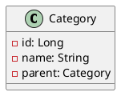

#### Members

##### Visibility

Visibility|Notation (UML)|Notation (PlantUML)
----------|--------------|-------------------
Public|`+`|`+`
Private|`-`|`-`
Protected|`#`|`#`
Derived|`/`|
Package|`~`|
Random|`*`|

Example:

```java
@startuml
class Class01 {
    -privateField: Long
    #protectedField: String
    +publicField: String
    ---
    -privateMethod(): void
    #protectedMethod(): void
    +publicMethod(): void
}
@enduml
```

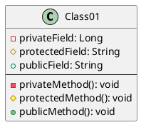

##### Scope

Scope|UML|PlantUML
-----|---|-------
instance|instance|
classifier|classifier|static or classifier
abstract| |abstract

Example:

```java
@startuml
class Class01 {
    instanceField: String
    {static} staticField: String
    ---
    instanceMethod(): void
    {static} staticMethod(): void
    {abstract} abstractMethod(): void
}
@enduml
```

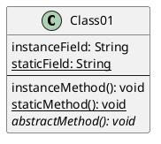

#### Relationships

##### Instance Level Relationships

Relationship|PlantUML
------------|--------
Dependency|..>
Association|-->
Aggregation|--o
Composition|--*

>Differences between Composition and Aggregation

>Composition relationship

>1. When attempting to represent real-world whole-part relationships, e.g. an engine is a part of a car.
>2. When the container is destroyed, the contents are also destroyed, e.g. a university and its departments.

>Aggregation relationship

>1. When representing a software or database relationship, e.g. car model engine ENG01 is part of a car model CM01, as the engine, ENG01, may be also part of a different car model.[7]
>2. When the container is destroyed, the contents are usually not destroyed, e.g. a professor has students, when the professor dies the students don't die along with him or her.

>Thus the aggregation relationship is often "catalog" containment to distinguish it from composition's "physical" containment.

Example:

```java
@startuml
Class01 ..> Class11: dependency
Class02 --> Class12: association
Class03 --o Class13: aggregation
Class04 --* Class14: composition
@enduml
```

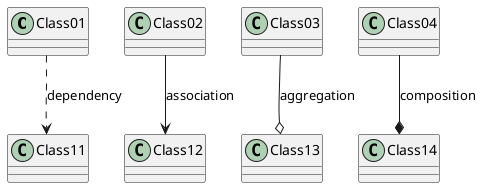

##### Class Level Relationships

Relationship|PlantUML
------------|--------
Generation/Inheritance|--\|>
Realization/Implementation|..\|>

Example:

```java
@startuml
Class01 --|> Class11: generation/inheritance
Class02 ..|> Class12: realization/implementation
@enduml
```

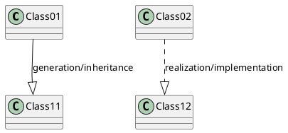

##### Multiplicity

Notation| Comment
--------|---------
0|No instances
0..1|No instances, or one instance
1|Exactly one instance
1..1|Exactly one instance
0..*|Zero or more instance
*|Zero or more instances
1..*|One or more instances

Example:

```java
@startuml
Class01 "1" *-- "0..*" Class02: contains
@enduml
```

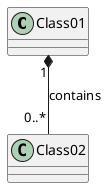

#### Stereotypes

A stereotype is one of three types of extensibility mechanisms in the Unified Modeling Language, the other two being tags and constraints. They allow designers to extend the vocabulary of UML in order to create new model elements, derived from existing ones, but that have specific properties that are suitable for particular domain or otherwise specialized usage.

> Stereotypes are defined with the class keyword, " << " and " >> ".

Example:

```java
@startuml
class Category <<Enity>> {
    -id: Long
    -name: String
    -parent: Category
}

class CategoryRepository <<Repository>>
Class CatalogController <<Controller>>
@enduml
```

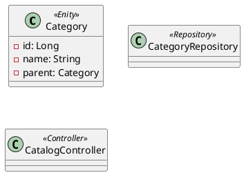

PlantUML built-in two stereotypes: abstract class and interface.

```java
@startuml
interface List<E>
abstract class AbstractList<E>
class ArrayList<E>

List <|.. ArrayList
AbstractList <|-- ArrayList
@enduml
```

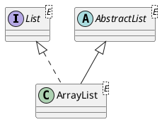

### Object Diagram

An **object diagram** in the Unified Modeling Langauge (UML), is a diagram that shows a complete or partial view of the structure of a modeled system at a specific time.

~TBD~

### Component Diagram

TBD

### Composite Structure Diagram

TBD

### Package Diagram

TBD

### Deployment Diagram

```java
@startuml
actor actor
agent agent
artifact artifact
boundary boundary
card card
cloud cloud
component component
control control
database database
entity entity
file file
folder folder
frame frame
interface  interface
node node
package package
queue queue
stack stack
rectangle rectangle
storage storage
usecase usecase
@enduml
```

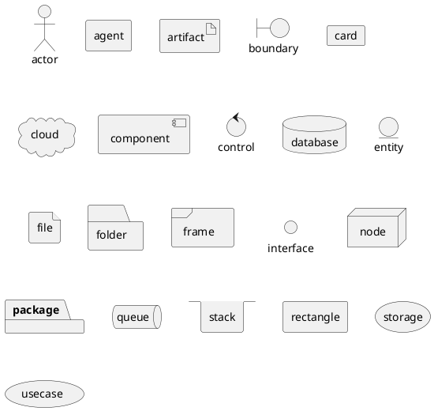

TBD

## Behavior Diagrams

* Use Case Diagram
* Activity Diagram
* State Machine Diagram

### Use Case Diagram

TBD

### Activity Diagram

TBD

### State Machine Diagram

>UML state machine, also known as UML statechart, is a significantly enhanced realization of the mathematical concept of a finite automaton in computer science applications as expressed in the Unified Modeling Language (UML) notation.
>
>The concepts behind it are about organizing the way a device, computer program, or other (often technical) process works such that an entity or each of its sub-entities is always in exactly one of a number of possible states and where there are well-defined conditional transitions between these states.
>
>UML state machine is an object-based variant of Harel statechart, adapted and extended by UML. The goal of UML state machines is to overcome the main limitations of traditional finite-state machines while retaining their main benefits. UML statecharts introduce the new concepts of hierarchically nested states and orthogonal regions, while extending the notion of actions. UML state machines have the characteristics of both Mealy machines and Moore machines. They support actions that depend on both the state of the system and the triggering event, as in Mealy machines, as well as entry and exit actions, which are associated with states rather than transitions, as in Moore machines.

The essentail elements of UML state machine is state and event. In PlantUML, it notates state by literal string, event by arrow. Special state **start** and **end** are all noted by `[*]`.

```java
@startuml

[*] --> State1
State1 --> [*]
State1 : this is a string
State1 : this is another string

State1 -> State2
State2 --> [*]

@enduml
```

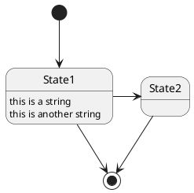

## Interaction Diagrams

* Sequence Diagram
* Communication Diagram
* Timing Diagram
* Interaction Overview Diagram

### Sequence Diagram

>A seqeunce diagram shows object interactions arranged in time sequence. It depicts the objects and classes involved in the scenario and the sequence of messages exchanged between the objects needed to carry out the functionality of the scenario. Sequence diagrams are typically associated with use case realizations in the Logical View of the system under develop,emt. Sequence diagrams are sometimes called **event diagrams** or **event scenarios**.
>
>A sequence diagram shows, as parallel vertical lines (lifelines), different processes or objects that live simultaneously, and, as horizontal arrows, the messages excchanged between them, in the order in which they occur. This allows the specification of simple runtime scenarios in a graphical manner.

A sequence diagram basically is built by **participant** and **message**.

Example:

```java
@startuml
Alice -> Bob: Authentication Request
Bob --> Alice: Authentication Response

Alice -> Bob: Another authentication Request
Alice <-- Bob: another authentication Response
@enduml
```

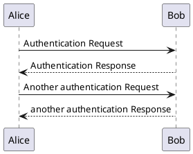

#### Participant

UML defines five stereotypes to participant:

* actor
* boundary
* control
* entity
* database

PlantUML supports all five participant stereotypes, additionally support **collections**.

```java
@startuml
actor Foo1
boundary Foo2
control Foo3
entity Foo4
database Foo5
collections Foo6
Foo1 -> Foo2 : To boundary
Foo1 -> Foo3 : To control
Foo1 -> Foo4 : To entity
Foo1 -> Foo5 : To database
Foo1 -> Foo6 : To collections

@enduml
```

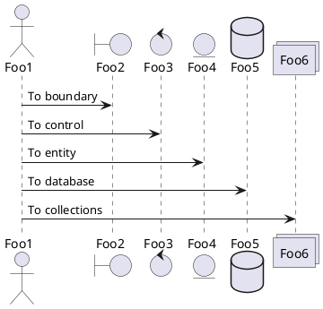

#### Message

UML Definition|PlantUml
--------------|--------
Synchronous message|`->`
Instantaneous message|
Found message|`[->`
Asynchronous message|`->>`
Message to self|`self -> self`
Creation and destruction|`create participant` `destroy participant`

```java
@startuml
Alice -> Bob: synchronous message
[-> Alice: found message
Alice ->> Bob: asynchronous message
Alice -> Alice: message to self
create Entity
Alice -> Entity: creation
Alice -> Entity: destruction
Alice <-- Entity
destroy Entity
@enduml
```

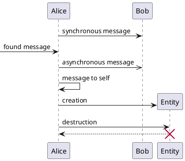

#### Conditional Interaction

```java
@startuml
actor user

user -> orderService: order
orderService -> inventoryService: checkInventory
orderService <-- inventoryService
alt inventory is enough
    orderService -> orderService: createOrder
    user <-- orderService: success
else
    user <-- orderService: fail
end
@enduml
```

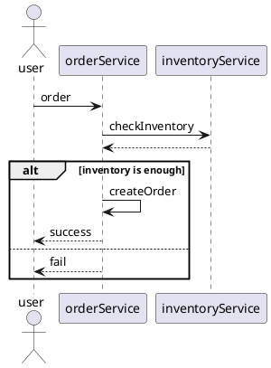

#### Repeated Interaction

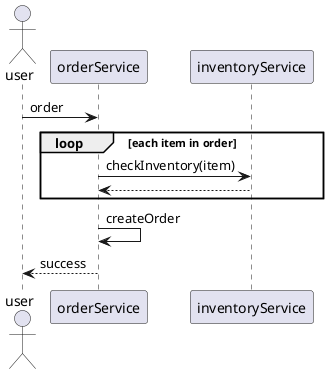

### Communication Diagram

TBD

### Timing Diagram

TBD

### Interaction Overview Diagram

TBD

## Reference

* [Unified Modeling Langauge](http://uml.org/what-is-uml.htm)
* [Introduction to OMG's Unifined Modeling Language](http://uml.org/what-is-uml.htm)
* [OMG®
 Unified Modeling Language®
 (OMG UML®
), Version 2.5.1](https://www.omg.org/spec/UML/2.5.1/PDF)