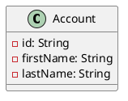
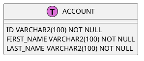
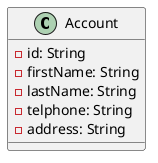
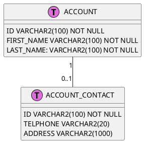
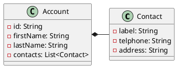
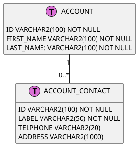
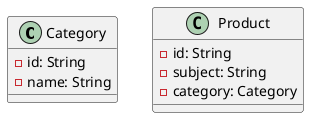

# Java Persistence API

## Overview

>The techincal objective of this work is to provide an object/relational mapping facility for the Java application developer using a Java domain model to manage a relational database.

## Entity Table Mapping

> An entity is a lightweight persistent domain object.
>
>The primary programming artifact is the entity class. An entity class may make use of auxiliary classes that serve as helper classes or that are used to represent the state of the entity.
>
>The persistent state of an entity is accessed by the persistence provider runtime either via JavaBeans style property accessors ("property access") or via instance variables ("field access"). Whether persistent properties or persistent fields or a combination of the two is used for the provider's access to a given class or entity hierarchy is determined as described in Section 2.3, "Access Type".
>Terminology Note: The persistent fields and properties of an entity class are generically referred to in this document as the "attributes" of the class.

An entity class should be mapped to one ore more relational tables. Entity may has attributes, simple type attribute should be mapped to single column, but complex type attribute may be mapped to extra tables.

### Single entity to one table

The simplest entity/table mapping is single entity to one table mapping. All attributes of entity are mapped to columns of one table.





```java
@Entity
@Table(name="ACCOUNT")
public class Account {
    @Id
    @Column(name="ID", length=100)
    private String id;
    @Column(name="FIRST_NAME", length=100)
    private String firstName;
    @Column(name="LAST_NAME", length=100)
    private String lastNane;
}
```

## Single entity to primary and secondary tables

More complex case is that mapping all attributes of entity to columns of more than one.
Considered of database IO tuning, it sometimes split a long table into multiple short tables. For example, entity `Account` has five fields, three of them (`id`, `firstName` and `lastName`) are always not empty, another two fields are nullable. If map all of them to one table, it will get a sparse table. Database IO operation will get more inefficient on sparse table. Therefore, it usually is splitted into two tables in practice.





```java
@Entity
@Table(name="ACCOUNT")
@SecondaryTable(name="ACCOUNT_CONTACT")
public class Account {
    @Id
    @Column(name="ID", length=100)
    private String id;
    @Column(name="FIRST_NAME", length=100)
    private String firstName;
    @Column(name="LAST_NAME", length=100)
    private String lastName;
    @Column(name="TELPHONE", length=20, table="ACCOUNT_CONTACT")
    private String telphone;
    @Column(name="ADDRESS", length=1000, table="ACCOUNT_CONTACT")
    private String address;
}
```

### Composition Entities

Composition is a common classes relationship. For example, `Account` composites `Contact`. `Contact` is a part of `Account`, when `Account` destroyed, `Contact` has to be destroyed together.





```java
@Embeddable
public class Contact {
    @Column(name="LABEL",length=50)
    private String label;
    @Column(name="TELPHONE",length=20)
    private String telphone;
    @Column(name="ADDRESS",length=1000)
    private String address;
}

@Entity
@Table(name="ACCOUNT")
public class Account {
    @Id
    @Column(name="ID",length=100)
    private String id;
    @Column(name="FIRST_NAME",length=100)
    private String firstName;
    @Column(name="LAST_NAME",length=100)
    private String lastName;
    @ElementCollection
    @CollectionTable(
        name="CONTACT",
        joinColumns=@JoinColumn(name="ID")
    )
    private List<Contact> contacts;
}
```

### Aggregation Entities

Unlike composition relationship, entities of aggregation are independent. For example, `Category` and `Product` are one-to-many relationship, but both of them are independent. When destroyed `Category`, it needn't destroy related `Product` together. Correspondingly, when destroyed `Product`, needn't destroy related `Category` together.

#### Many-to-One



#### One-to-Many

TBD

### Aggregation Entities

## Entity Operation

## Query Interface

## Caching

## Reference

* [Java Persistence/Relationships](https://en.wikibooks.org/wiki/Java_Persistence/Relationships)
