# Java Persistence API

* TOC
{:toc}

## Overview

>The techincal objective of this work is to provide an object/relational mapping facility for the Java application developer using a Java domain model to manage a relational database.

## Entity Table Mapping

> An entity is a lightweight persistent domain object.
>
>The primary programming artifact is the entity class. An entity class may make use of auxiliary classes that serve as helper classes or that are used to represent the state of the entity.[5]

JPA is designed to **map Object-Oriented model to Relational model**, NOT ~~map Relational model to Object-Oriented model~~.

### Object-Oriented Model

In object-oriented model, everything is object. An object is a unit which contains states and behaviors. In most implementation, the states of object are stored in **instance variables(field)**; and the behaviors of object are declared as **methods**. Objects comunicate through sending and receiving messages. The behaviors of object are response to these messages, and change internal states or send new messages.

>Languages that support object-oriented programming typically use inheritance for code reuse and extensibility in the form of either classes or prototypes.[6]

Java is a class-based Object Oriented programming language. Java support two main concepts:

* Class - the definitions for fields and methods
* Object - instance of class

Classes relate to others in many ways:

* Inheritance
* Association
* Composition
* Aggregation

### Relational Model

>The term `relation` is used here in its accepted mathematical sense. Given sets $S_1, S_2, ..., S_n$ (not neccessarily distinct), `R` is a relation on these n sets if it is a set of n-tuples each of which has its first element from $S_1$, its second element from $S_2$, and son on. We shall refer to $S_1$ as the jth domain of R. As defined above, R is said to have degree n. Relations of degree 1 are often called unary, degree 2 binary, degree 3 ternary, and degree n n-ary.[2]


### Map Entity

Objeject Oriented Model|Relational Model
-----------------------|----------------
Entity|Table
Field|Column
Property|Column
Identifier|Primary Key

#### Single entity to one table

The simplest entity/table mapping is single entity to one table mapping. All attributes of entity are mapped to columns of one table.

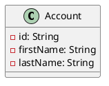

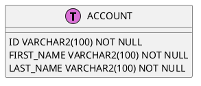

```java
@Entity
@Table(name="ACCOUNT")
public class Account {
    @Id
    @Column(name="ID", length=100)
    private String id;
    @Column(name="FIRST_NAME", length=100)
    private String firstName;
    @Column(name="LAST_NAME", length=100)
    private String lastNane;
}
```

#### Single entity to primary and secondary tables

More complex case is that mapping all attributes of entity to columns of more than one.
Considered of database IO tuning, it sometimes split a long table into multiple short tables. For example, entity `Account` has five fields, three of them (`id`, `firstName` and `lastName`) are always not empty, another two fields are nullable. If map all of them to one table, it will get a sparse table. Database IO operation will get more inefficient on sparse table. Therefore, it usually is splitted into two tables in practice.

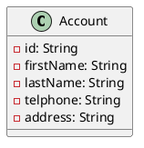

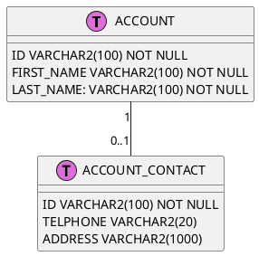

```java
@Entity
@Table(name="ACCOUNT")
@SecondaryTable(name="ACCOUNT_CONTACT")
public class Account {
    @Id
    @Column(name="ID", length=100)
    private String id;
    @Column(name="FIRST_NAME", length=100)
    private String firstName;
    @Column(name="LAST_NAME", length=100)
    private String lastName;
    @Column(name="TELPHONE", length=20, table="ACCOUNT_CONTACT")
    private String telphone;
    @Column(name="ADDRESS", length=1000, table="ACCOUNT_CONTACT")
    private String address;
}
```

#### Composition

Composition is a common classes relationship. For example, `Account` composites `Contact`. `Contact` is a part of `Account`, when `Account` destroyed, `Contact` has to be destroyed together.

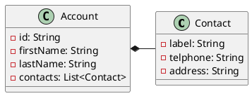

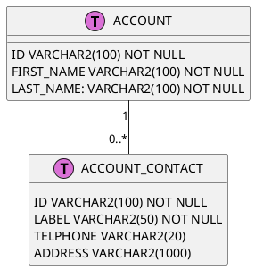

```java
@Embeddable
public class Contact {
    @Column(name="LABEL",length=50)
    private String label;
    @Column(name="TELPHONE",length=20)
    private String telphone;
    @Column(name="ADDRESS",length=1000)
    private String address;
}

@Entity
@Table(name="ACCOUNT")
public class Account {
    @Id
    @Column(name="ID",length=100)
    private String id;
    @Column(name="FIRST_NAME",length=100)
    private String firstName;
    @Column(name="LAST_NAME",length=100)
    private String lastName;
    @ElementCollection
    @CollectionTable(
        name="CONTACT",
        joinColumns=@JoinColumn(name="ID")
    )
    private List<Contact> contacts;
}
```

#### Aggregation

Unlike composition relationship, entities of aggregation are independent. For example, `Category` and `Product` are one-to-many relationship, but both of them are independent. When destroyed `Category`, it needn't destroy related `Product` together. Correspondingly, when destroyed `Product`, needn't destroy related `Category` together.

##### Unidirectional OneToMany

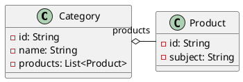

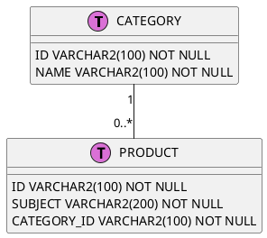

```java
@Entity
@Table(name="PRODUCT")
public class Product {
    @Id
    @Column(name="ID", length=100)
    private String id;
    @Column(name="SUBJECT", length=200)
    private String subject;
}

@Entity
@Table(name="CATEGORY")
public class Category {
    @Id
    @Column(name="ID", length=100)
    private String id;
    @Column(name="NAME", length=100)
    private String name;
    @OneToMany
    @JoinColumn(
        name="CATEGORY_ID",
        referencedColumnName="ID"
        )
    private List<Product> products;
}
```

> JPA 1.0 does not support a unidirectional OneToMany relationship without a JoinTable. Since JPA 2.0 there is a support for unidirectional OneToMany. In JPA 2.x a @JoinColumn can be used on a OneToMany to define the foreign key, some JPA providers may support this already.

##### ManyToOne

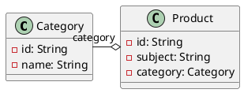

```java
@Entity
@Table(name="PRODUCT")
public class Product {
    @Id
    @Column(name="ID", length=100)
    private String id;
    @Column(name="SUBJECT", length=200)
    private String subject;
    @ManyToOne
    @JoinColumn(name="CATEGORY_ID")
    private Category category
}

@Entity
@Table(name="CATEGORY")
public class Category {
    @Id
    @Column(name="ID", length=100)
    private String id;
    @Column(name="NAME", length=100)
    private String name;
}
```

##### Bidirectional OneToMany

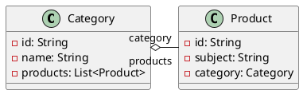

```java
@Entity
@Table(name="PRODUCT")
public class Product {
    @Id
    @Column(name="ID", length=100)
    private String id;
    @Column(name="SUBJECT", length=200)
    private String subject;
    @ManyToOne
    @JoinColumn(name="CATEGORY_ID")
    private Category category
}

@Entity
@Table(name="CATEGORY")
public class Category {
    @Id
    @Column(name="ID", length=100)
    private String id;
    @Column(name="NAME", length=100)
    private String name;
    @OneToMany(mappedBy="category")
    private List<Product> products;
}
```

#### Association

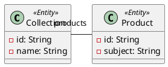

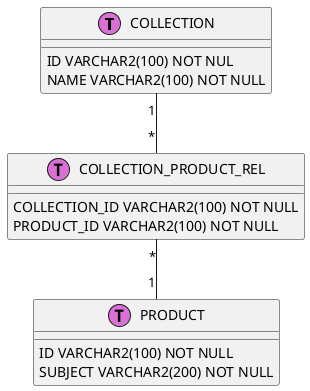

```java
@Entity
@Table(name="PRODUCT")
public class Product {
    @Id
    @Column(name="ID", length=100)
    private String id;
    @Column(name="SUBJECT", length=200)
    private String subject;
}
@Entity
@Table(name="COLLECTION")
public class Collection {
    @Id
    @Column(name="ID")
    private String id;
    @Column(name="NAME")
    private String name;
    @ManyToMany
    @JoinTable(
        name="COLLECTION_PRODUCT_REL",
        joinColumns=@JoinColumn(name="COLLECTION_ID", referencedColumnName="ID"),
        inverseJoinColumns=@JoinColumn(name="PRODUCT_ID", referencedColumnName="ID")
    )
    private List<Product> products;
}
```

>Although a ManyToMany relationship is always bi-directional on the database, the object model can choose if it will be mapped in both directions, and in which direction it will be mapped in. If you choose to map the relationship in both directions, then one direction must be defined as the owner and the other must use the mappedBy attribute to define its mapping. This also avoids having to duplicate the JoinTable information in both places.
>
>If the mappedBy is not used, then the persistence provider will assume there are two independent relationships, and you will end up getting duplicate rows inserted into the join table. If you have a conceptual bi-directional relationship, but have two different join tables in the database, then you must not use the mappedBy, as you need to maintain two independent tables.
>
>As with all bi-directional relationships it is your object model's and application's responsibility to maintain the relationship in both direction. There is no magic in JPA, if you add or remove to one side of the collection, you must also add or remove from the other side, see object corruption. Technically the database will be updated correctly if you only add/remove from the owning side of the relationship, but then your object model will be out of synch, which can cause issues.[1]

#### Inheritance

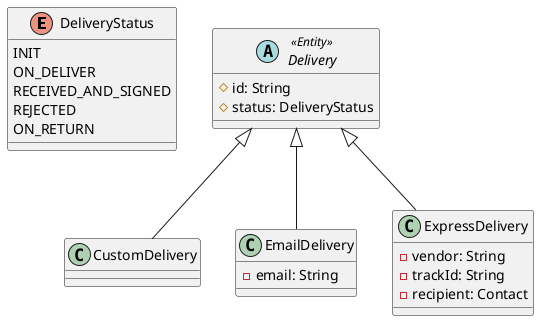

There are three basic strategies that are used when mapping a class or class hierarchy to a relational database:

* single table per class hierarchy
* joined subclass strategy
* table per concrete entity class

##### Single Table per Class Hierarchy Strategy

In this strategy, all the classes in a hierarchy are mapped to a single table. The table has a column that servers as a "discriminator column", that is, a column whose value identifies the specific subclass to which the instance taht is represented by the row belongs.
This mapping strategy provides good support for polymorphic relationships between entities and for queries that range over the class hierarchy.
It has the drawback, however, that it requires that the columns that correspond to state specific to the subclasses be nullable.

```puml
@startuml
class DELIVERY << (T, chid) >> {
    ID VARCHAR2(100) NOT NULL
    STATUS VARCHAR2(50) NOT NULL
    DELIVERY_TYPE VARCHAR2(20) NOT NULL
    EMAIL VARCHAR2(100)
    VENDOR VARCHAR2(100)
    TRACK_ID VARCHAR2(50)
    CONTACT_ID VARCHAR2(100)
}
class CONTACT << (T, chid) >> {
    ID VARCHAR2(100) NOT NULL
    TELPHONE VARCHAR2(20) NOT NULL
    ADDRESS VARCHAR2(1000) NOT NULL
}
DELIVERY "1" - "0..1" CONTACT
@enduml
```

```java
@Entity
@Inheritance
@DiscriminatorColumn(name="DELIVERY_TYPE")
@Table(name="DELIVERY")
public abstract class Delivery {
    @Id
    @Column(name="ID", length=100)
    protected String id;
    @Column(name="STATUS", length=50)
    protected DeliveryStatus status;
}

@Entity
@DiscriminatorValue("CUSTOM")
public class CustomDelivery extends Delivery {

}

@Entity
@DiscriminatorValue("EMAIL")
public class EmailDelivery extends Delivery {
    @Column(name="EMAIL", length=100)
    private String email;
}

@Entity
@DiscriminatorValue("EXPRESS")
public class ExpressDelivery extends Delivery {
    @Column(name="VENDOR", length=100)
    private String vendor;
    @Column(name="TRACK_ID", length=50)
    private String trackId;
    @OneToOne
    @JoinColumn(name="CONTACT_ID")
    private Contact contact;
}
```

##### Joined Subclass Strategy

In the joined subclass strategy, the root of the class hierarchy is represented by a single table. Each subclass is represented by a separate table that contains those fields that are specific to the subclass (not inherited from its superclass), as well as the column(s) that represent its primary key. The primary key column(s) of the subclass table serves as a foreign key to the primary key of the superclass table.
This strategy provides support for polymorphic relationships between entities.
It has the drawback that it requires that one or more join operations be performed to instantiate instances of a subclass. In deep class hierarchies, this may lead to unacceptable performance. Queries that range over the class hierarchy likewise require joins.

```puml
@startuml
class DELIVERY << (T, chid) >> {
    ID VARCHAR2(100) NOT NULL
    STATUS VARCHAR2(50) NOT NULL
    DELIVERY_TYPE VARCHAR2(20) NOT NULL
}
class CUSTOM_DELIVERY << (T, chid) >> {
    ID VARCHAR2(100) NOT NULL
}
class EMAIL_DELIVERY << (T, chid) >> {
    ID VARCHAR2(100) NOT NULL
    EMAIL VARCHAR2(100) NOT NULL
}
class EXPRESS_DELIVERY << (T, chid) >> {
    ID VARCHAR2(100) NOT NULL
    VENDOR VARCHAR2(100) NOT NULL
    TRACK_ID VARCHAR2(50) NOT NULL
    CONTACT_ID VARCHAR2(100) NOT NULL
}
DELIVERY "1" -- "0..1" CUSTOM_DELIVERY
DELIVERY "1" -- "0..1" EMAIL_DELIVERY
DELIVERY "1" -- "0..1" EXPRESS_DELIVERY
@enduml
```

```java
@Entity
@Inheritance(strategy=InheritanceType.JOINED)
@DiscriminatorColumn(name="DELIVERY_TYPE")
@Table(name="DELIVERY")
public abstract class Delivery {
    @Id
    @Column(name="ID", length=100)
    protected String id;
    @Column(name="STATUS", length=50)
    protected DeliveryStatus status;
}

@Entity
@DiscriminatorValue("CUSTOM")
@Table(name="CUSTOM_DELIVERY")
public class CustomDelivery extends Delivery {

}

@Entity
@DiscriminatorValue("EMAIL")
@Table(name="EMAIL_DELIVERY")
public class EmailDelivery extends Delivery {
    @Column(name="EMAIL", length=100)
    private String email;
}

@Entity
@DiscriminatorValue("EXPRESS")
@Table(name="EXPRESS_DELIVERY")
public class ExpressDelivery extends Delivery {
    @Column(name="VENDOR", length=100)
    private String vendor;
    @Column(name="TRACK_ID", length=50)
    private String trackId;
    @OneToOne
    @JoinColumn(name="CONTACT_ID")
    private Contact contact;
}
```

##### Table per concrete Class Strategy

In this mapping strategy, each class is mapped to a separate table. All properties of the class, including inherited properties, are mapped to columns of the table for the class.
This trategy has the following drawbacks:

* It provides poor support for polymorphic relationships.
* It typically requires that SQL UNION queries (or a separate SQL query per subclass) be issued for queries that are intended to range over the class hierarchy.

```puml
@startuml
class CUSTOM_DELIVERY << (T, chid) >> {
    ID VARCHAR2(100) NOT NULL
    STATUS VARCHAR2(50) NOT NULL
}
class EMAIL_DELIVERY << (T, chid) >> {
    ID VARCHAR2(100) NOT NULL
    STATUS VARCHAR2(50) NOT NULL
    EMAIL VARCHAR2(100) NOT NULL
}
class EXPRESS_DELIVERY << (T, chid) >> {
    ID VARCHAR2(100) NOT NULL
    STATUS VARCHAR2(50) NOT NULL
    VENDOR VARCHAR2(100) NOT NULL
    TRACK_ID VARCHAR2(50) NOT NULL
    CONTACT_ID VARCHAR2(100) NOT NULL
}
@enduml
```

```java
@Entity
@Inheritance(strategy=InheritanceType.TABLE_PER_CLASS)
public abstract class Delivery {
    @Id
    @Column(name="ID", length=100)
    protected String id;
    @Column(name="STATUS", length=50)
    protected DeliveryStatus status;
}

@Entity
@Table(name="CUSTOM_DELIVERY")
public class CustomDelivery extends Delivery {

}

@Entity
@Table(name="EMAIL_DELIVERY")
public class EmailDelivery extends Delivery {
    @Column(name="EMAIL", length=100)
    private String email;
}

@Entity
@Table(name="EXPRESS_DELIVERY")
public class ExpressDelivery extends Delivery {
    @Column(name="VENDOR", length=100)
    private String vendor;
    @Column(name="TRACK_ID", length=50)
    private String trackId;
    @OneToOne
    @JoinColumn(name="CONTACT_ID")
    private Contact contact;
}
```

## Entity Operation

TBD

## Query Interface

TBD

## Caching

TBD

## Appendix

### Normal Forms

>Codd introduced the concept of normalization and what is now known as the first normal form (1NF) in 1970. Codd went on to define the second normal form (2NF) and third normal form (3NF) in 1971, and Codd and Raymond F. Boyce defined the Boyce-Codd normal form (BCNF) in 1974.
>
>Informally, a relational database relation is often described as "normalized" if it meets third normal form.[7] Most 3NF relations are free of insertion, update, and deletion anomalies.
>
>The normal forms (from least normalized to most normalized) are:
>
> * UNF: Unnormalized form
> * 1NF: First normal form
> * 2NF: Second normal form
> * 3NF: Third normal form
> * EKNF: Elementary key normal form
> * BCNF: Boyce-Codd normal form
> * 4NF: Fourth normal form
> * ETNF: Essential tuple normal form
> * 5NF: Fifth normal form
> * DKNF: Domain-key normal form
> * 6NF: Sixth normal form[2]

#### First Normal Form (1NF)

>If normalization as described above is to be applicable, the unnormalized collection of relations must satisfy the following conditions:
>
>(1) The graph of interrelationships of the nonsimple domains is a collection of trees.
>(2) No primary key has a component domain which is nonsimple.[2]

#### Second Normal Form (2NF)

>Specifically: a relation is in 2NF if it is in 1NF and no non-prime attribute is dependent on any proper subset of any candidate key of the relation. A non-prime attribute of a relation is an attribute that is not a part of any candidate key of the relation.[3]

#### Third Normal Form (3NF)

>all the attributes in a table are determined only by the candidate keys of that relation and not by any non-prime attributes.[4]

An entity class should be mapped to one ore more relational tables. Entity may has attributes, simple type attribute should be mapped to single column, but complex type attribute may be mapped to extra tables.

## Reference

1. [Java Persistence/Relationships](https://en.wikibooks.org/wiki/Java_Persistence/Relationships)
2. [A Relational Model of Data for Large Shared Data Banks, E. F. Codd, IBM Research Laboratory, San Jose, California](https://www.seas.upenn.edu/~zives/03f/cis550/codd.pdf)
3. [Second normal form](https://en.wikipedia.org/wiki/Second_normal_form)
4. [Third normal form](https://en.wikipedia.org/wiki/Third_normal_form)
5. [Java Persistence API]()