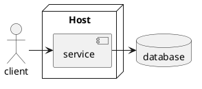
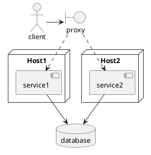
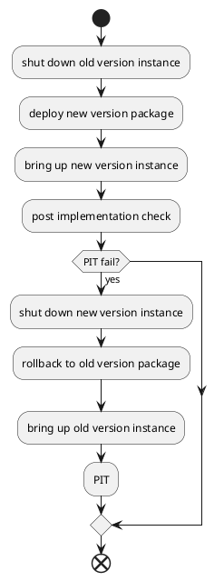
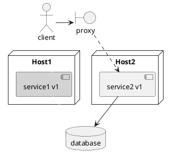
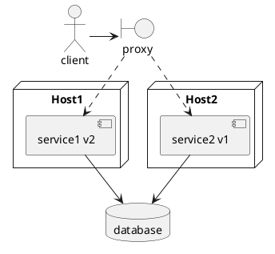
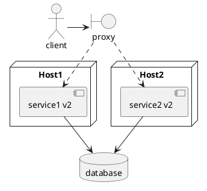
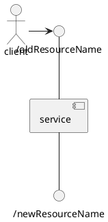
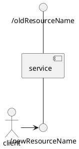
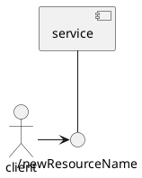
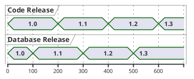

# After Reading Migrating to Microservices Databases

Mini book **Migrating to Microservice Databases** describes an approach to archive **Zero Downtime** deployment for Microservices Architectural application.

## Service Deployment

Tranditional deployment arhcitectures have the clients issuing requests directly to server deployment.

It has to undeploy current version of application and then deploy new one to the running system. This will result in an undesirable amount of downtime.

To archive Zero Downtime deployment, we need to add another component. Instead of allowing users to directly connect to application services, we now have another process receiving the client's requests and forwarding them to services. The new addition to the architecture is usually called a **proxy** or a **load balancer**. And the services must be redundant. So that when we shutted down them one by one for deploying new version, there are still active service instances to accept requests.

Changes deployment is not one exit operation. It may end with rollback. Therefore a completed deployment plan must include rollback plan.

Take updating service from version `v1` to `v2` as example, firstly shut down instance `service1`.

Because `service` instances are redudant. When instance `service1` is down, instance `service2` is still alive, therefore the `service` is still available.

Then, deploy `v2` package and bring up instance `service1`. Two versions of service are running at same time. Certain client request may be routed to certain version one. Well known, `v1` is compatible with client and database. `v2` must be compatible with client and database too. Shortly, the changes which introduced by `v2` must be backward-compatible.

And then, do post-implementation-check. If everything is working as expected, then apply update on other instances gradually. In our case, it should apply update on `service2`.

If changes on instance `service1` does not match expected, it has to rollback `service1` from `v2` to `v1`.

### Backward-Compatible Service Change

To archive Zero Downtime deployment, the changes of service must be backward-compatible. Service cooperate with others through API contract. In our example, service cooperate with client through RESTful API contract, with database through JDBC and schema contract.

#### Backward-Compatible RESTFul API Change

RESTFul API is resource-centric. The key components of RESTFul API contract are:

* Resource
    * name
    * property
        * name
        * type
* Method

All potential changes:

Component|Add|Change|Remove
---------|---|------|------
Resource name|Y|Y|Y
Property name|Y|Y|Y
Property type|Y|Y|Y
Method|A| |Y

##### Add Resource Name

In RESTFul API, it identifys resource name by URL, and each resource has itself URL endpoint. Therefore adding a new resource would not cause any backward-compatible issue.

##### Change Resource Name

Changing resource name is implemented as changing URL endpoint. Changing URL ednpoint will break consumer components. it should take create-migration-destroy process. Firstly expose new resource with new name; then migrate all consumer component to new resource endpoint; finally destroy old resource endpoint.

## Database Schema Deployment

To archive Zero Downtime deployment, services are updated gradually. It means that two versions of serivce are accessing database simultaneously.

TBD

Code changes and database(schema) changes must be decoupled, so that they could be released and rolled back independnetly.

For example, assume the version of code and database are 1.0 and 1.0 respectively. Now we want to make cahnges which involve code and schema changes. It should release schema changes in database release 1.1 firstly, then release code changes in code release 1.1.

With decoupling code changes and schema changes, it's able to minimize the changes batch size, and reduce down time.

## Mutually Compatible Schema Change

>Schema versions between consecutive releases must be mutually compatible. It also means that we can't create database migrations that are destructive. Destructive here means that we can't afford to lose any data, so we can't issue any steatement that can potentially cuase the loss of data.

### Add a Column Migration

Adding a column should follow steps:

1. Add column in schema, the new column must be NULLABLE
2. release code which populates the new column
3. set new column to NOT NULL if business logic required

### Rename a column Migration

### Drop Table

Dropping table is destroyed. It must remove reference from code, then drop table from database. Supposed that we want to drop table in database 1.3, it must remove all reference from code in code release 1.2. Then when we dropped table in database, it would not break anything.

### Add a Column

## Integration Strategies

TBD

app