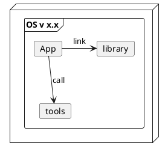
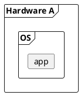
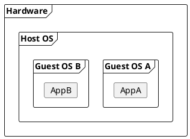
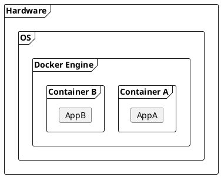

# Introduction to Docker

## What

TBD

## Why

## Backup and Recovery

Backup all files and recover to new hardware.

## Virtualization

## Containerization

## How 

TBD

## When

TBD

## Reference

