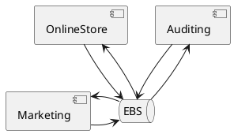
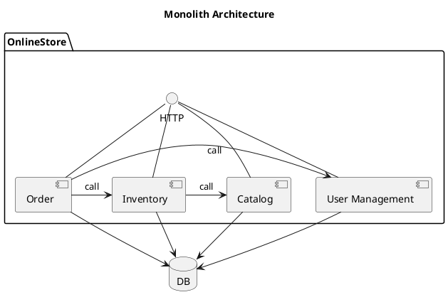
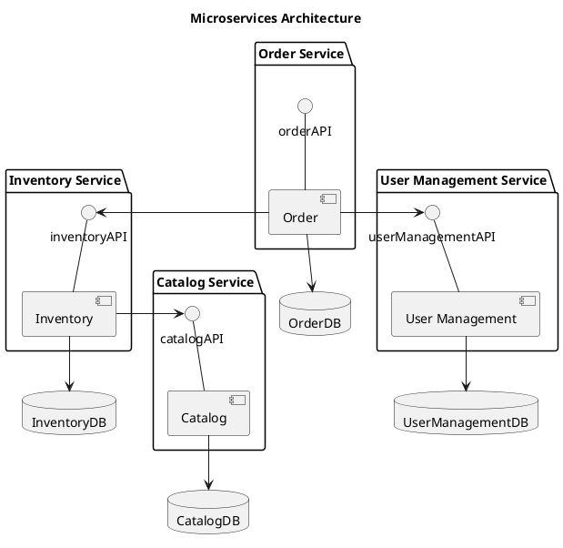
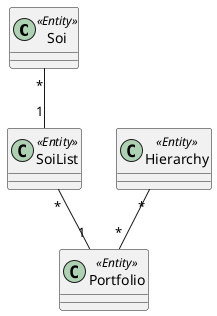
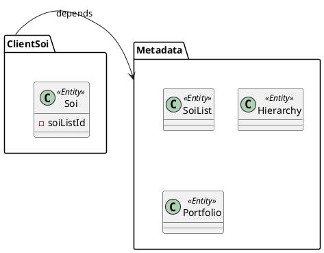
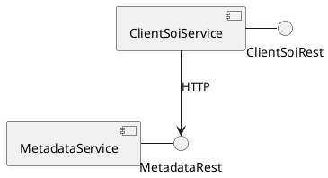

---
presentation:
  slideNumber: true
  center: false
  enableSpeakerNotes: true
  theme: "solarized.css"
---
<!-- slide -->
## Design Microservices by DDD

<!-- slide data-notes="今天，我分享使用領域驅動設計方法設計担供RESTful風格API的微服務。今天的內容分為四個部份，我會先簡單介紹一下微服務、RESTful和DDD領域驅動設設，最後再舉個例子，將三者結合起來。" -->
## Agenda

* Microservices
* RESTful
* Domain Driven Design (DDD)
* Example

<!-- slide data-notes="首先，介紹一下微服務。這是維基百科上對微服務的描述。從這包話𥚃可以發現兩個重點：variant of the service oriented architecture, 微服務是SOA的一個變種；a collection of loosely coupled services, 一組鬆耦合的服務。SOA簡單地講就是把業務功能劃分為多個服務，服務和服務之間通過統一的通信協議集成，比如通過message bus。微服務就是把服務分得更細。" -->
## What's Microservices

>Microservices are a software development technique—a **variant of the service-oriented architecture (SOA)** architectural style that structures an application as **a collection of loosely coupled services**.

[Microservices](https://en.wikipedia.org/wiki/Microservices)

<!-- slide data-notes="SOA對服務的劃分粒度較大。比如，對於一個電子商務業務，SOA可能就會將其劃分為在線商店服務、營銷服務、審計服務等。所有服務都通過統一的通信通道，比如EBS。而微服務則將服務劃分得更細。" -->
## SOA



<!-- slide data-notes="Monolith單體這個詞是相對的。以在線商店模块為例，在SOA中，已經是一個細分的服務了；而在微服務中，其就是一個巨大的單體應用。" -->
## Monolith



<!-- slide data-notes="要應用微服務架構，在線商度模块需被進一步細分。比如分為Catalog, Inventory, Order和User management。每個微服務都應拥有獨立的數據存儲。服務和服務之間也是按需依賴。" -->
## Microservices



<!-- slide data-notes="微服務有很多特性。我覺得讓Developer受益最大的是：Decentralized Governance, Decentralized Data management, Evolutionary Design." -->
## Characteristics

* Componentization via Services
* Organized around Business Capabilities
* Products not Projects
* Smart endpoints and dump pipes
* Decentralized Governance
* Decentralized Data Management
* Infrastructure Automation
* Design for failure
* Evolutionary Design

<!-- slide -->
## RESTFul

>Representational State Transfer (REST) is a software architectural style that defines a set of constraints to be used for creating Web services. 

[Representational state transfer](https://en.wikipedia.org/wiki/Representational_state_transfer)

<!-- slide -->
## Constraints

* Client-server architecture
* Statelessness
* Cacheability
* Layered system
* Uniform interface

<!-- slide -->
## Richardson Maturity Model


<!-- slide -->
## Level 0

```http
POST /api/level0/operation HTTP/1.1
Content-Type: application/json;charset=UTF-8
Accept: application/json
Host: localhost:8080
Content-Length: 86

{
  "command" : "createPost",
  "parameters" : {
    "content" : "Test post 123"
  }
}
```

<!-- slide -->
## Level 0

```http
HTTP/1.1 200 OK
Content-Type: application/json
Content-Length: 164

{
  "status" : "SUCCESS",
  "message" : "",
  "parameters" : {
    "id" : 3,
    "content" : "Test post 123",
    "createdAt" : "Sun Mar 11 15:43:11 CST 2018"
  }
}
```

<!-- slide -->
## Level 1

```http
POST /api/level1/post HTTP/1.1
Content-Type: application/json
Accept: application/json
Host: localhost:8080
Content-Length: 117

{
  "command" : "create",
  "data" : {
    "id" : null,
    "content" : "Test Post 123",
    "createdAt" : null
  }
}
```

<!-- slide -->
## Level 1

```http
HTTP/1.1 200 OK
Content-Type: application/json;charset=UTF-8
Content-Length: 160

{
  "status" : "SUCCESS",
  "message" : null,
  "data" : {
    "id" : 5,
    "content" : "Test Post 123",
    "createdAt" : "2018-03-11T07:43:11.840+0000"
  }
}
```

<!-- slide -->
## Level 2

```http
POST /api/level2/post HTTP/1.1
Content-Type: application/json
Accept: application/json
Host: localhost:8080
Content-Length: 73

{
  "id" : null,
  "content" : "New Post content",
  "createdAt" : null
}
```

<!-- slide -->
## Level 2

```http
HTTP/1.1 201 Created
Content-Type: application/json;charset=UTF-8
Content-Length: 97

{
  "id" : 21,
  "content" : "New Post content",
  "createdAt" : "2018-04-30T12:02:08.667+0000"
}
```

<!-- slide -->
## Level 3

```http
POST /comments HTTP/1.1
Content-Type: application/json
Accept: application/json
Host: localhost:8080
Content-Length: 66

{
  "id" : null,
  "content" : "comment 1",
  "createdAt" : null
}
```

<!-- slide -->
## Level 3

```http
HTTP/1.1 201 Created
Location: http://localhost:8080/comments/5af80a6f18151728a745b2ae
Content-Type: application/json;charset=UTF-8
Content-Length: 263

{
  "content" : "comment 1",
  "createdAt" : null,
  "_links" : {
    "self" : {
      "href" : "http://localhost:8080/comments/5af80a6f18151728a745b2ae"
    },
    "comment" : {
      "href" : "http://localhost:8080/comments/5af80a6f18151728a745b2ae"
    }
  }
}
```

<!-- slide -->
## Level 3

```http
POST /posts/5af80a6f18151728a745b2ad/comments HTTP/1.1
Content-Type: text/uri-list
Host: localhost:8080
Content-Length: 55

http://localhost:8080/comments/5af80a6f18151728a745b2ae
```

<!-- slide -->
## Domain Driven Design (DDD)

>Domain-driven design (DDD) is an approach to software development for complex needs by connecting the implementation to an evolving model.

[Domain-driven-design](https://en.wikipedia.org/wiki/Domain-driven_design)

<!-- slide -->
## Domain Driven Design (DDD)

* placing the project's primary focus on the core domain and domain logic;
* basing complex designs on a model of the domain;
* initiating a creative collaboration between technical and domain experts to iteratively refine a conceptual model that addresses particular domain problems.

<!-- slide -->
## Building blocks

* Bounded context
* Entity
* Value object
* Aggregate

<!-- slide -->
## Example



<!-- slide -->
## Example



<!-- slide -->
## Example



<!-- slide -->
## Example

```
http://metadata/soiList
http://metadata/hierarchy
http://metadata/portfolio

http://clientSoi/soi?soiListId=...
```
