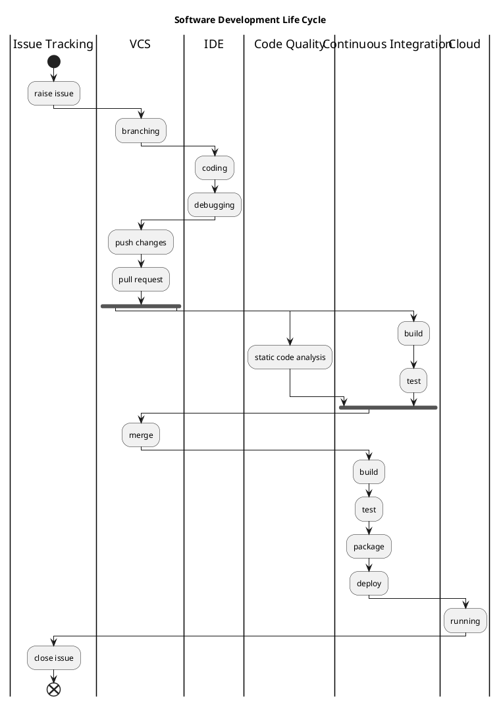

# 用于个人开源项目的免费软件开發生命周期(SDLC)工具

## 摘要

介绍可用于个人开源项目的软件开發生命周期工具(SDLC)。

## 为什么要做个人开源项目

* 试验新技术
* 练习编程技巧
* 展现能力

## 为入么要 SDLC

* SDLC 是一个合格码農的重要技能

## 为什么用工具

* 成熟的流程和工具可以提升生产率

## 为什么要免费

* 因为沒钱

## SDLC

## 工具

### Issue Tracking

* [Github Issue](https://github.com/issues), plan:
  * **Free** $0
  Unlimited public repositories 无限的公开仓库
  * **Developer** $7/month
  Unlimited public and private repositories 无限的公开/私有仓库

* [ZenHub](https://www.zenhub.com/), plan:
  * **Free** $0
  For small teams, public accounts, open source
    * Work inside GitHub with the ZenHub browser extension
    * Access the ZenHub web app from anywhere
    * Epics, Estimates and Reports
    * Multi-repo support, API access and Slack integration
  * **Growth** $5 per user/month
  For teams of six or more
    * Work inside GitHub with the ZenHub browser extension
    * Access the ZenHub web app from anywhere
    * Epics, Estimates and Reports
    * Multi-repo support, API access and Slack integration

### VCS

* [GitHub](https://github.com), plan:
  * **Free** $0
  Unlimited public repositories
  * **Developer** $7/month
  Unlimited public and private repositories

* [BitBucket](https://bitbucket.org/)
  * **Free** $0/user/month
  For small teams
    * Free up to 5 users
  * **Standard** $2/user/month, starts at $10/month
  For growing teams
  * **Premium** $5/user/month, starts at $25/month
  For large teams

### IDE

* [Intellij IDEA Community Edition](https://www.jetbrains.com/idea/), `Capable and Ergonomic IDE for JVM`
* [Atom] (https://atom.io/), `A hackable text editorfor the 21st Century`
* [Visual Studio Code](http://code.visualstudio.com/), `Code editing. Redefined. Free. Open source. Runs everywhere.`

### Code Quality

* [Codacy](https://www.codacy.com), plan:
  * **Open Source** $0
  Free for open source projects
  * **Pro** $18 per user/month
  Unlimited private repositories
    * Faster analysis
    * Priority support

* [CodeClimate](https://codeclimate.com/)
  * **Free** $0
  Free for both private and open source projects
    * See technical debt and test coverage directly on GitHub
    * One month of historical trends
    * Extensible with 30+ open source static analysis tools
    * For a single user
  * **Code Climate Essentials** $12 per seat/month
  Everything small teams need to merge with confidence
    * Code quality and test coverage results directly on GitHub
    * One month of historical trends
    * Extensible with 30+ open source static analysis tools
  * **Code Climate Standard** $20 per seat/month
  Technical debt reduction for teams of 20+
    * Everything from Essentials plus...
    * Team management
    * Organization-wide configuration
    * 6 months of historical trends

### Continuous Integration

* [Travis CI](http://travis-ci.com/), plan:
  * **Open Source** $0
  We offer free CI for Open Source projects
    * Unlimited public repositories
    * Unlimited collaborators
  * **Bootstrap** $89/month
  Ideal for hobby and small projects
    * 1 Concurrent job
    * Unlimited build minutes
    * Unlimited repositories
    * Unlimited collaborators
  * **Startup** $199/month
  Best suited for small teams
    * 3 Concurrent jobs
    * Unlimited build minutes
    * Unlimited repositories
    * Unlimited collaborators
  * **Small Business** $349/month
  Great for growing teams
    * 6 Concurrent jobs
    * Unlimited build minutes
    * Unlimited repositories
    * Unlimited collaborators
* [CircleCI](https://circleci.com/?utm_source=github&utm_medium=partner&utm_campaign=ghmarketplace), plan:
  * **Free** $0
  Free for both open source and private projects
    * Unlimited Repos
    * Unlimited Users
    * 4x build concurrency for open source projects
    * 1x build concurrency for private projects
  * **Bootstrap** $69/month
  2 containers allow you to run 2x parallelism and 2x concurrency
    * Unlimited Repos
    * Unlimited Users
    * 2x build parallelism
    * 2x build concurrency
  * **Startup** $189/month
  4 containers allow you to run 4x parallelism and 4x concurrency
    * Unlimited Repos
    * Unlimited Builds
    * 4x build parallelism
    * 4x build concurrency
  * **Growth** $299/month
  6 containers allow you to run 6x parallelism and 6x concurrency
    * Unlimited Repos
    * Unlimited Builds
    * 6x build parallelism
    * 6x build concurrency

### Cloud

* [Amazon AWS](https://aws.amazon.com), [AWS Free Tier](https://aws.amazon.com/free/?nc1=h_ls)
* [Microsoft Azure](https://azure.microsoft.com)
* [Google Cloud Platform](https://cloud.google.com/)

## My Solution

* Issue Tracking
  * Github Issue, Free plan
  * ZenHub, Free Plan

* VCS
  * GitHub, Free plan

* IDE
  * Intellij IDEA Community Edition, for Java development
  * Visual Studio Code, for others

* Code Quality
  * Codacy, Open Source plan

* Continuous Integration
  * Travis CI, Free plan
  * CircleCI, Free plan

* Cloud
  * AWS, Free Tier

